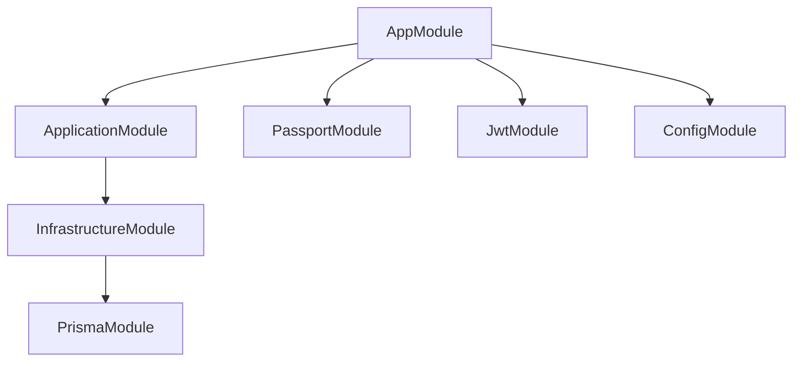
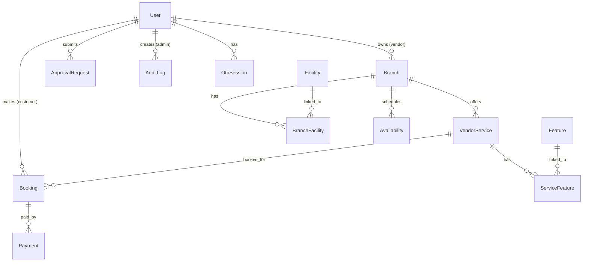

# AtSpaces — System Architecture

## 1. High-Level System Overview

AtSpaces is a coworking space booking and management platform that connects **Customers** looking for workspace with **Vendors** who operate branches, all managed by **Admins** who oversee approvals and platform analytics.

```
┌─────────────┐     HTTPS/REST      ┌──────────────────────────────┐
│   Frontend   │ ◄──────────────────► │        NestJS API Server      │
│  (Next.js)   │      JWT Auth       │          Port 3001             │
└─────────────┘                      └──────────┬───────────────────┘
                                                 │
                              ┌──────────────────┼──────────────────┐
                              │                  │                  │
                      ┌───────▼──────┐   ┌───────▼──────┐   ┌──────▼───────┐
                      │  PostgreSQL   │   │   OpenAI API  │   │  SMTP Server │
                      │   (Prisma)    │   │ (Recommend.)  │   │   (Email)    │
                      └──────────────┘   └──────────────┘   └──────────────┘
```

## 2. Architecture Pattern — Clean Architecture

The backend follows **Clean Architecture** (also known as Hexagonal / Onion Architecture), organized into four concentric layers with strict dependency rules. Inner layers never depend on outer layers.

```
┌─────────────────────────────────────────────────┐
│                 Presentation Layer               │
│    Controllers, Guards, Decorators, DTOs         │
├─────────────────────────────────────────────────┤
│                 Application Layer                │
│    Services, Use Cases, Business Orchestration   │
├─────────────────────────────────────────────────┤
│                   Domain Layer                   │
│    Entities, Value Objects, Enums, Interfaces    │
├─────────────────────────────────────────────────┤
│               Infrastructure Layer               │
│    Prisma Repositories, Email, SMS, Webhooks     │
└─────────────────────────────────────────────────┘
```

### Layer Responsibilities

| Layer | Folder | Responsibility |
|-------|--------|----------------|
| **Domain** | `src/domain/` | Core business entities, enums, value objects, and repository interfaces. Zero external dependencies. |
| **Application** | `src/application/` | Service classes that orchestrate domain logic, DTOs for input validation, and exception classes. |
| **Infrastructure** | `src/infrastructure/` | Prisma ORM repositories, external service integrations (email, SMS, webhook validation), and database access. |
| **Presentation** | `src/presentation/` | HTTP controllers, NestJS guards, route decorators, and request/response handling. |
| **Common** | `src/common/` | Cross-cutting concerns: JWT strategy, auth guards, RBAC decorators, and shared utilities. |

## 3. Main Components and Modules

### Module Hierarchy



### Key Modules

| Module | Purpose |
|--------|---------|
| `AppModule` | Root module. Registers global config, JWT, and Passport. |
| `ApplicationModule` | Registers all services, controllers, guards, and maps repository interfaces to implementations. |
| `InfrastructureModule` | Provides Prisma repositories, email/SMS services, and webhook validation. |
| `PrismaModule` | Singleton `PrismaService` (extends `PrismaClient`) for database access. |

## 4. Technologies Used

| Category | Technology | Purpose |
|----------|-----------|---------|
| **Runtime** | Node.js 18+ | JavaScript runtime |
| **Framework** | NestJS 10 | Backend framework with DI, decorators, and module system |
| **Language** | TypeScript 5 | Type-safe development |
| **ORM** | Prisma 6 | Database access, schema management, migrations |
| **Database** | PostgreSQL 15+ | Primary relational datastore |
| **Authentication** | Passport + JWT | Stateless token-based auth |
| **Password Hashing** | bcrypt | Secure password storage |
| **API Docs** | Swagger / OpenAPI | Auto-generated at `/api/docs` |
| **AI** | OpenAI GPT | Branch recommendation engine |
| **Build System** | Turborepo | Monorepo management |
| **Package Manager** | npm | Dependency management |

## 5. Database Schema Overview

The PostgreSQL database contains **13 models** and **10 enums**:



### Enums

| Enum | Values |
|------|--------|
| `UserRole` | `customer`, `vendor`, `admin` |
| `UserStatus` | `pending`, `active`, `suspended` |
| `BranchStatus` | `active`, `suspended`, `pending` |
| `ServiceName` | `hot_desk`, `private_office`, `meeting_room` |
| `PriceUnit` | `hour`, `day`, `week`, `month` |
| `BookingStatus` | `pending`, `confirmed`, `completed`, `cancelled`, `no_show` |
| `PaymentStatus` | `pending`, `paid`, `failed` |
| `PaymentMethod` | `cash`, `card`, `apple_pay` |
| `RequestType` | `capacity_change`, `pause_branch`, `activate_branch` |
| `ApprovalStatus` | `pending`, `approved`, `rejected` |

## 6. Design Decisions

| Decision | Rationale |
|----------|-----------|
| **Clean Architecture** | Decouples business logic from framework, making it testable and portable. |
| **Repository Pattern** | Domain defines interfaces (`IBookingRepository`), infrastructure provides Prisma implementations. Services depend only on interfaces. |
| **JWT Stateless Auth** | Scales horizontally without session stores. Token carries `{ sub, role, email }`. |
| **Guard Composition** | `JwtAuthGuard → RolesGuard → OwnershipGuard` — layered security, each guard has a single responsibility. |
| **Webhook Validation as Guard** | Signature validation runs before any controller logic executes, rejecting invalid payloads at the gate. |
| **Audit Logging** | Every admin state change is recorded with actor, action, entity, and IP for compliance. |
| **Prisma over Raw SQL** | Type-safe queries, automatic migration management, and generated TypeScript types. |
| **Monorepo (Turborepo)** | Shared configs and coordinated builds between API and future frontend. |
