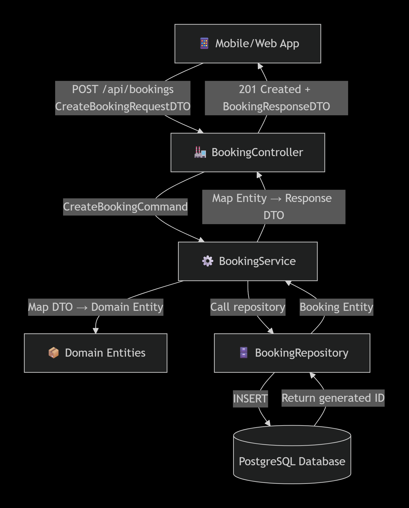
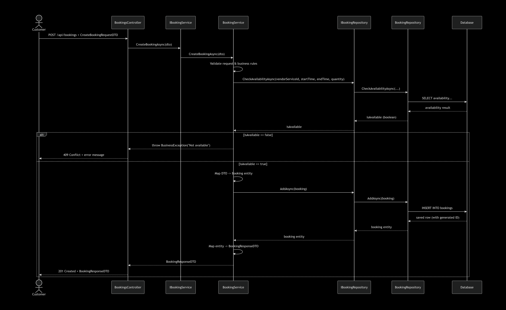

# Project  At Spaces

## Work Flow

- Work Flow
    
    
    ## **Customer**
    
    - Code
        
        ```html
        flowchart TD
          A([Start]) --> B[Enter Platform]
        
          B --> C{Does customer want to<br>login/sign up now?}
        
          C -- Yes --> D[Show Login / Sign Up Page]
          C -- No --> E[Continue as Guest]
        
          %% Login/Sign Up Page
          D --> F{Choose action}
        
          F -- Login --> G{Login method?}
          F -- Sign Up --> H[Sign Up as new customer]
        
          %% Sign Up Flow
          H --> H1{Choose sign up method}
        
          H1 -- Phone --> H2[Enter phone number +962]
          H1 -- Email --> H3[Enter email + create password]
        
          H2 --> H4[Send OTP code to phone]
          H4 --> H5[Verify OTP code]
          H5 --> H6{Code correct?}
        
          H6 -- No --> H7[Error - try again]
          H7 --> H5
        
          H6 -- Yes --> H8[Account created successfully]
          H8 --> I[Login successful]
        
          H3 --> H9[Save email + password]
          H9 --> H10[Account created successfully]
          H10 --> I
        
          %% Login Flow
          G -- Phone --> J[Enter phone number +962]
          G -- Email --> K[Enter email + password]
        
          J --> J1[Send OTP code to phone]
          J1 --> J2{OTP code correct?}
        
          J2 -- No --> J3[Error message - try again]
          J3 --> J
        
          J2 -- Yes --> I
        
          K --> K1{Email registered?}
        
          K1 -- No --> K2[Email not found]
          K2 --> K3[Show option to go to Sign Up]
          K3 --> F
        
          K1 -- Yes --> K4{Password correct?}
        
          K4 -- No --> K5[Error - wrong password]
          K5 --> K
        
          K4 -- Yes --> I
        
          I --> L[Browse platform]
        
          %% Guest browsing
          E --> M[Browse platform as Guest]
        
          %% Both paths continue to browsing
          L --> N{Browse or use AI?}
          M --> N
        
          N -- Browse services --> O[Display services list<br>Hot Desk - Private Office - Meeting Room]
          N -- Use AI assistant --> P[Open chat with AI assistant]
        
          P --> P1[Specify location, time and duration]
          P1 --> P2[AI suggests best branch]
          P2 --> O
        
          O --> Q[Select service and branch]
        
          %% NEW: عرض المرافق والميزات
          Q --> Q1[Display branch facilities<br>WiFi, Parking, Elevator, etc.]
          Q1 --> Q2[Display service features<br>Meeting table, Whiteboard, Screen, etc.]
          Q2 --> Q3{Continue with this selection?}
        
          Q3 -- No --> O
          Q3 -- Yes --> R[Enter booking details<br>date, duration, number of people]
        
          R --> S{Selected service?}
        
          S -- Hot Desk --> T[Check seat availability]
          S -- Private Office --> U[Check office availability]
          S -- Meeting Room --> V[Check time slot availability]
        
          T --> W{Available?}
          U --> W
          V --> W
        
          W -- No --> X[Display unavailability message<br>and suggest alternatives]
          X --> Q
        
          W -- Yes --> Y[Calculate total price<br>Jordanian Dinar]
        
          %% Check if user is logged in at booking stage
          Y --> Z{Is customer logged in?}
        
          Z -- Yes --> AA[Proceed to payment]
          Z -- No --> AB[Redirect to Login / Sign Up]
          
          %% Connect back to Login/Sign Up page
          AB --> D
        
          %% Payment phase
          AA --> AJ{Choose payment method}
        
          AJ -- Apple Pay - Visa - MasterCard --> AK[Redirect to payment gateway]
          AJ -- Cash --> AL[Confirm payment on arrival]
        
          AK --> AK1[Electronic payment process]
          AK1 --> AK2{Payment successful?}
        
          AK2 -- No --> AK3[Payment failed - try another card]
          AK3 --> AJ
        
          AK2 -- Yes --> AM[Confirm booking]
          AL --> AM
        
          %% Booking confirmation
          AM --> AN[Create new booking in system]
          AN --> AO[Send confirmation to customer]
        
          AO --> AP{Post-booking options}
        
          AP -- Add to calendar --> AQ[Add event to calendar]
          AP -- View directions --> AR[Show branch access map]
          AP -- End --> AS([End of customer journey])
        
          AQ --> AS
          AR --> AS
        ```
        
    - Pant **Customer**
        
        English
        
        [Online FlowChart & Diagrams Editor - Mermaid Live Editor](https://mermaid.live/edit#pako:eNqNV91u2zYUfhVCQIEWddrIduLEGDootlPHTmI7zk9bJRe0TMtaZFGgpHiekIsNGzDsRQrsbrsYsDdJ3maHPKQsu0Wxm0Qkv_P7HR4e55bHp8xqWrOQL705FSm5bN9GhDgv3XEKy7tXZGfnHTlyO1HKBBmGNJ1xsbi7jSTqSB228jZnCfGyJOULAC1plJKUfzcR70LuB9HbJPAjksUk4svvH1GyBZLkI0hJBW13POdLcirB5C0ZS_hVTIbUZ3cF-JwrbMdt8SgNoowRmpD3GUtS7cyLF6jhbVleHrSV4HHemnOegJiXBjzSfhxL1WhYgt7n-L1g6ZxPpbMaYnRKUNc1K_AgYssi8rUjBnAMaZVbXRS0jQ8mI2hH-9K1paXhnEcM4VWd9VhtRdliAovXh_vVuzW8s6BBiPCahjO19Zp4gtGUkZgmyZKLqfauW0V03R2zaEoGl0MiawAIQzuou46gPfeaiWC2KmB4uoen-3lLSnpcCOalhtrufomubsPtCMEF2SGpWBHq0yBCHQ1toSxkCqJ74DqexzOoIwxiSpLM81iSzLIwXKGCAwU9cZGx9bmJs4aqDt0xfWBFUkrZAMyh5mX3f9izd9HgZrUVFL_fJK_3Te7eb1LX32Jui7IearS_xVjPRlA1L863eOlVS7z0apqXBQQJ9-QLfnqYvl5Z1tCjU9BH3-0cAxHMDxKIgk2Nxb5dstiHala4iKdkBrlGCvpYjv0a9gAey8spQ_O5_KsvEkLRpeOycuNSv54PddK24-7Xy17sFfW4FDzyN-uhj4XdLwtuBX2iFqfukeBLuMjxZkOEqlAtiUzkcRD5crOjRM62Rb7Sv454OgeP0jl0U9PlIAllZadK2XmulUEkGfxzTrBXneEpKjyX7mtcwsRD4OlQBm47SMCN1Xo7BOpkw-4COW2W3EN-hiJ4kP1jMJsBBDbOGAOXfHLB-eKuMHClzEMwCaiQnV9aGLqDmEUEXpSULAMIqozQ8Q4RCVUdM0_2mJB7VLJfIWmwgD4NtT7NhNpS5oZY4sOqC9qSzPchdwmZYLpp5M0RhQU1QCMDtRjBzQmhJEy8Sncho5N_3rlpkqd_n_56-oc8fX7-9fk3-Pz8_PPzL-T5d9x4_uPp76fPT39KiRFqtotcoj4yo14QBmnAEpnPm-A4qMBLJO4hcxXSCRnklIsKYan3Rvk7wqhG1W1SyAw6USZQj8l9Sichq5CbeZCyCadiWiFjaFksKmvEDIxqefFUKg7SeZCAcpkISKm5HqNa6XoM1jum7i90b5pwLmMgU5bCLVZOTaE8KgVHFdPl-IzEjMch07m9UHrGOXIgeysGaDwYS3PrwgPspduaM-8egFA_9AHs0YlMKnZihd-uTpC60lIct74uVy5iJXWtpVTNJSH_wqAUvVTQm9zBo5DhdbvCbfl5bT7l4qaU0g8Fr1lU1mw6r0ykLEdd0ISGkO0IMvrAEuX2B2SzpNlQ89Ft0dDLQpmHlKc0JLGAyKXGHrQ0GgU0Iu0goqXJBIMNZrJtCAIFASOaD5zASwa5NiTDPcXZ6aMy9Ck_Kc13hYQh8FPZKcdxh4J7DBDygaKrBVNXXsN0Vpwj94JNA9mnJWxr9FNw4zCPIomaUEkS35rxYu2ng6Nou4hziIbhhaQJIhw03DMzmHZtcwZz5FtLnBiqV6qArncdJFQ2PyrfthbcOFTT3_Df6PKBiiXFckNVLZrMUeJUTq6zABq_QcNDR4WsYzOzOH2t3HY78q7ACxV4BTyWaU2wKJy-raHV3IS6HlkMMU6__OY78Mga7AwKERjSrz48yXMg1qP6HXT0U-v0NvQUFJ8VoeiCQalTfVp6z7CcPESrNqGQ-E45524LZ1Q5RZvak8PcCpKNb4xzjtABDj9lTTLxW6O3g_3eGeZDnqQ7RiVOFYnJylBxPFUF6tEQ9FKBciNXbrMHpn7BFId3a7HrAFxF4qVKFLvA4UW_AFTRQBY0Lsl1Il0445eu_IYmWVyoH3gmIra6e6X9G2mkWlzohVWxfBFMrWYqMlaxQA6mKVhaubosFjC4YLdWEz7B4_tb6zZ6BJmYRp-g1RkxwTN_bjVnNExglcWyhbcD6gu6KHYFxAylLsdhq9moN5QSq5lbP1rNHduuv9mrHtSrdsNu7DaqFWtlNWt7bw7r-_ZBHU5qjcPd2t5jxfpJmQV0rXoIWuxdONvfr1csuDfwBJ7hD0_1-_PxP7FPp-o)
        
    
    - **Code Customer**  With Security
        
        ```json
        flowchart TD
          A([Start]) --> B[Enter Platform]
        
          B --> C{Does customer want to<br>login/sign up now?}
        
          C -- Yes --> D[Show Login / Sign Up Page]
          C -- No --> E[Continue as Guest]
        
          D --> F{Choose action}
        
          F -- Login --> G{Login method?}
          F -- Sign Up --> H[Sign Up as new customer]
        
          %% Sign Up Flow
          H --> H1{Choose sign up method}
        
          H1 -- Phone --> H2[Enter phone number +962]
          H2 --> H2a["Apply rate limit & CAPTCHA<br>Sanitize input"]
          H2a --> H4["Send OTP code to phone<br>OTP expires in 5 min, one-time use"]
          H4 --> H5["Verify OTP code<br>Max 5 attempts, then lock"]
          H5 --> H6{Code correct?}
        
          H6 -- No --> H7[Error - try again]
          H7 --> H5
        
          H6 -- Yes --> H8[Account created successfully]
          H8 --> I["Login successful<br>Rotate session ID"]
        
          H1 -- Email --> H3[Enter email + create password]
          H3 --> H3a["Check password breach<br>Add CAPTCHA<br>Sanitize input"]
          H3a --> H9["Save email + password hash<br>Use parameterized queries"]
          H9 --> H10[Account created successfully]
          H10 --> I
        
          %% Login Flow
          G -- Phone --> J[Enter phone number +962]
          J --> J0["Rate limit per phone/IP<br>Sanitize input"]
          J0 --> J1["Send OTP code to phone<br>OTP expires in 5 min, one-time use"]
          J1 --> J1a["Max 5 OTP attempts, then lock"]
          J1a --> J2{OTP code correct?}
        
          J2 -- No --> J3[Error - try again]
          J3 --> J
        
          J2 -- Yes --> I
        
          G -- Email --> K[Enter email + password]
          K --> K0["Rate limit per email/IP<br>Sanitize input"]
          K0 --> K1{Email registered?}
        
          K1 -- No --> K2[Generic error: Invalid credentials]
          K2 --> K3[Show option to go to Sign Up]
          K3 --> F
        
          K1 -- Yes --> K4{Password correct?}
        
          K4 -- No --> K5[Generic error: Invalid credentials]
          K5 --> K
        
          K4 -- Yes --> K6["Check if password compromised; enforce MFA if needed"]
          K6 --> I
        
          I --> L[Browse platform]
        
          %% Guest browsing
          E --> M[Browse platform as Guest]
        
          L --> N{Browse or use AI?}
          M --> N
        
          N -- Browse services --> O["Display services list<br>Hot Desk - Private Office - Meeting Room"]
          N -- Use AI assistant --> P["Open chat with AI assistant<br>Sanitize input, prompt hardened, user-scoped data"]
        
          P --> P1[Specify location, time and duration]
          P1 --> P2[AI suggests best branch]
          P2 --> O
        
          O --> Q[Select service and branch]
        
          Q --> Q1["Display branch facilities<br>WiFi, Parking, Elevator, etc.<br>Fetch with parameterized queries"]
          Q1 --> Q2["Display service features<br>Meeting table, Whiteboard, Screen, etc.<br>Fetch with parameterized queries"]
          Q2 --> Q3{Continue with this selection?}
        
          Q3 -- No --> O
          Q3 -- Yes --> R["Enter booking details<br>date, duration, number of people<br>Sanitize input"]
        
          R --> S{Selected service?}
        
          S -- Hot Desk --> T["Check seat availability<br>Use atomic transactions & parameterized queries"]
          S -- Private Office --> U["Check office availability<br>Use atomic transactions & parameterized queries"]
          S -- Meeting Room --> V["Check time slot availability<br>Use atomic transactions & parameterized queries"]
        
          T --> W{Available?}
          U --> W
          V --> W
        
          W -- No --> X["Display unavailability message<br>and suggest alternatives"]
          X --> Q
        
          W -- Yes --> Y["Calculate total price server-side<br>Jordanian Dinar"]
        
          Y --> Z{Is customer logged in?}
        
          Z -- Yes --> Z_sec[Server-side auth check]
          Z_sec --> AA[Proceed to payment]
          Z -- No --> AB[Redirect to Login / Sign Up]
          AB --> D
        
          %% Payment phase
          AA --> AJ{Choose payment method}
        
          AJ -- Apple Pay - Visa - MasterCard --> AK["Redirect to PCI-DSS certified gateway<br>No local card storage"]
          AJ -- Cash --> AL["Confirm payment on arrival<br>Requires verified account, max 2 concurrent cash bookings"]
        
          AK --> AK1[Electronic payment process]
          AK1 --> AK1a[Server-side amount verification with gateway]
          AK1a --> AK2{Payment successful?}
        
          AK2 -- No --> AK3[Payment failed - try another card]
          AK3 --> AJ
        
          AK2 -- Yes --> AK4[Verify webhook signature and event ID]
          AK4 --> AM[Confirm booking]
        
          AL --> AL1[Check cash booking limits]
          AL1 --> AM
        
          AM --> AM_sec["Server-side ownership validation (prevent IDOR)"]
          AM_sec --> AN["Create new booking in system<br>Use parameterized queries"]
          AN --> AO[Send confirmation to customer]
        
          AO --> AP{Post-booking options}
        
          AP -- Add to calendar --> AQ["Add event to calendar<br>Sanitize ICS fields, no malicious URLs"]
          AP -- View directions --> AR["Show branch access map<br>Use whitelisted, validated URLs"]
          AP -- End --> AS([End of customer journey])
        
          AQ --> AS
          AR --> AS
        ```
        
    - Pant **Customer**  With Security
        
        [Online FlowChart & Diagrams Editor - Mermaid Live Editor](https://mermaid.live/view#pako:eNqtWG1v2zgS_iuEgD20WKeNHcdOcoc9qHZebMeJEyfptkpxYCTa5kUWtaQU1zX632-GQ8pKeu31gH4JLGlen3lmOMwmiFUigqNglqpVvOC6YDf9-4yx8FU0LeDx02u2s_MHexcdZ4XQbJLyYqb08tN9hlLv7Mfepq-EYXFpCrUEoRXPClaofzzoP1I1l9lbI-cZK3OWqdU_v5JmDzTZB9BCA_1oulArdo7C7C2bovhtziZ8Lj5VwhfKyh5HPZUVMisF44adlsIULpi-_X6y6S2UMvA1LqTKnLsTtED2Ueh0Q7-XolioBGNyIt41Cp1F_gkcZWJVJej8_fZbJX4C6OGrM1Js-hh84uTHxXLWRE-ThcoEibccuLl9lZXLB3j4_bDTssmftZwUj-6DMM_TNdO8ECyVS1mwv7FeOLnpnYWI9pRnspBfBJNZXhb3gdPnZKAN-lORJezyZsKw7FAj8om6-FJ8zqWGmgAy-2wpswaDjzuFXApWGuHttcncPpi7E1rO1pVBtDPmn0GZF4VY5oVpsGIhMpaq-NGr75N6Z9PDEGKltYgLT4uzTq3UZ93oWGul2Q4r9JrxOZcZ2ei6EOpKnkxnB1EYx6oEDsZaAFIJM2UcC2NmZZquycCBFR1ACkSErQTmcK0KRNjAG6AQG_Rt7NvaHS-5TMnZnqudsK9-dy5Zzo1ZKZ2Qtz0nixXsLUT8WH1nDyAfL9BpmCT_u5Z7rpaHWEv-JCq_lcEFN9bcrcEoNAfqQZG-AAp_lfBDGG_q0HF19yfgau4SXhXxCTVP-9PnhB7-kM9DktmFDK63PM69_NvB5LvpDymMYfPXMHnYdOawLsRb1P0-d0GSNFqbyvMLAg9bNQIP975D4CExYljX8fx1IJ8-J9roBc-eEWxEIv8FUiv-I0hHBOmouSFfWsylAUci8RmNmrWMRq3oVGTAo5gJzOyIDbInnsoEyZMIGMw8NWSYxtZoj2a7ynEaY53mCv-6yUmihMZJ3Z9HY9TeTDy1X0A9atcD2__pwGgAjepGKm-dqkPlbNtTsVrmWi2lEcnfmcjgAIwFG5-EKJQJMJ94NDv1Eg7sw3n0TqsVduPzsxO6yJ5eMALgs8zm-PLYqoxfqrw86s6t2MXGiQHDgNUsHNBJNqavJHqB-Tk5I_STjF2ul5BqXxpwsd5-SKH4yJUzVbC-MI_A3ImWT0iqy9kMRODFWAg4f-fsWqmly9s6ubUhQKgGjOAKgF4m4OUyhzaC5aJgK1ksnsl8y8sGQ6jzAgaZhrqJpIG56R0TqxxmU8ILXk3jCbloRtNcxHgQQa9y5Bm0LrY6hxGRlNq-snFOqOMnrQiCMOV8DpAa9kBV4Fm8ICmi7iU5ubQPV9FUpEA-D5W1Xemg3BXJNWuw0nc247FMIUVhMN338kQ2YLfRjwBigx2nAuBVusFEEb9BgRP4sSCofjTAryiXq9a3dWQzGOSlJn--XAV_SEWDvV_IQjwoALfBptAbIvv_PRM-V3ubahWzOsVCGggBYQLAfZte7dXa9HL7xvfcNcRPs-1BKcSEJaKAUWSDh3JDzL6GDX-YKGhOofJUfGeuoZdra326obrhsUbg-LimGMSW5yB7UzW_AfwYf4Io-AOWbu1PVKjUEkZMAYU1tGAaWMF-BJZ187KHwNlt5UzRy1_ort6h1tld5cz2hUnVr0kPPd5YD-83IdlLBQ2hW3qNP-_8T3x4X2PDnzXqllk9INiYjYH1HwPDTnO9yngKYWRAhqcq4z-JjDXrnlkfMGuexmWK2Bew1KUwXBBrpALOFEk76xCGPJCIZ6wvM66r1D5YMx83g9rlBm40c0BBVvz-WHf58V9GxDAqKvOMl9AZMWJvo7UCVjQMo4lWMRwfdnvh6yWcUp8qiw6i8F10LRKJ5x6KvbgiWfGQbmH96liZkC3YiDjsOigRkq2hv5c4b8_vJSFuZgxvGAJNwKS_k4bjwOe4EfRgZJCZEe4ZtaAmvcFOfzplsdCFnElIaA6Ar7ilFeSBUzllMeoDiBrK6kpHHnuwsZLhcyyYymYSTjwfIiwNXGP70GYu_irtYveENw90xWl5bbAlLHAtOKqzuIQ1AddZtOtmypau4cgl0YyOcTBolQHjvbccK2JoUQhHTS_Kn5d0addlCoEOHBqALm2vzZ16a-Mrst2sPXvCUX1hDGFd8rIz6AbIz62OmYJlVFsQnfk9V9NndjwPw1E7cpezlXiAoj_au6g9FezRJZ7Qx6DvjNGdLhxHHn6Hmwft3BWoGdEYqWNL66bD7NxhNnaKY_do-wK39i2MagX7mlnInNlFjXB8lWsf2uX1a8-T8bZrLpAjdMnCO7mPAe9wa6Dp8mfuPuEF2bqM7C0ippy531Bf3PND2gDCyWaiTLHjPdJGa3wdJ7Z5EtvMQHewyzXpXeG9PfGQ1z4_O7wGvSkDQqcJ3DsyBWxOZSxVadjt9XkVt3VyJyFv6j47oK0TPEXtou12Dm6JBmZyD8gKD37c73ClcogDMt-YP85cm09fRfgbztpq-P1blToT60-vXdJXTtI-XLuHoBHMtUyCo0KXohGAHtws4DHYoNh9AERewgQ4gp8AAtyt7rOvoJPz7COcV15Nq3K-CI5msLbDU5ljtH3J51DVSgRQhLmEzRgcHbStieBoE3wOjnZanfabVrPVPmh1mwf7rcPdvUawDo6a7YM3ncN297DdOdjvwq-vjeCL9dp50z3sdPe73d1u-6BzeHjYCGDEwbga0z_I7P_Jvv4HxeU2tQ)
        
    
    ## **Vendor**
    
    - Code **Vendor**
        
        ```html
        flowchart TD
          A([Start]) --> B{Has account?}
        
          B -- No --> C[Register as new vendor]
          B -- Yes --> D[Login<br>Email + Password]
        
          C --> C1[Enter branch details<br>and personal information]
          C1 --> C2[Send approval request to admin]
          C2 --> C3{Approved?}
        
          C3 -- No --> C4[Notification: Request rejected<br>with reason]
          C4 --> C
        
          C3 -- Yes --> C5[Activate vendor account]
          C5 --> D
        
          D --> E{Account status?}
        
          E -- Inactive --> F[Notification: Account under review<br>or suspended]
          F --> A
        
          E -- Active --> G[Enter dashboard]
        
          G --> H[View overview]
        
          H --> H1[Today's occupancy<br>Upcoming bookings count]
          H --> H2[Branch status<br>Calm - Moderate - Busy]
          H --> H3[Notifications and alerts]
        
          H1 --> I{What does vendor want?}
          H2 --> I
          H3 --> I
        
          I -- Capacity Management --> J[Go to capacity management page]
          I -- Pricing Management --> K[Go to pricing management page]
          I -- Branch Facilities --> BF[Go to branch facilities page]
          I -- Service Features --> SF[Go to service features page]
          I -- View Bookings --> L[Go to bookings page]
          I -- Reports --> M[Go to reports page]
          I -- Profile --> N[Account settings]
        
          J --> J0[Select service type]
        
          J0 --> J1[Hot Desk<br>Shared seats]
          J0 --> J2[Private Office<br>Private offices]
          J0 --> J3[Meeting Room<br>Meeting rooms]
        
          J1 --> J1A[View current settings]
          J1A --> J1B[Total seats count]
          J1B --> J1C{Want to modify?}
        
          J1C -- Yes --> J1D[Change seat count]
          J1D --> J1E[Enable/Disable seats]
          J1E --> J1F[Temporary pause with duration]
          J1F --> J1G[Create approval request for admin]
        
          J1C -- No --> J1H[Return to list]
        
          J2 --> J2A[View available offices]
          J2A --> J2B[Number of offices<br>Size of each office]
          J2B --> J2C{Want to modify?}
        
          J2C -- Yes --> J2D[Add/Remove office]
          J2D --> J2E[Modify office size]
          J2E --> J2F[Change availability status]
          J2F --> J2G[Create approval request for admin]
        
          J2C -- No --> J2H[Return to list]
        
          J3 --> J3A[View rooms]
          J3A --> J3B[Each room capacity<br>Time slots]
          J3B --> J3C{Want to modify?}
        
          J3C -- Yes --> J3D[Modify room capacity]
          J3D --> J3E[Enable/Disable time slots]
          J3E --> J3F[Create approval request for admin]
        
          J3C -- No --> J3G[Return to list]
        
          J1G --> J4[Send capacity change request]
          J2G --> J4
          J3F --> J4
        
          J4 --> J5[Save request in queue]
          J5 --> J6[Notification: Waiting for admin approval]
        
          J1H --> I
          J2H --> I
          J3G --> I
          J6 --> I
        
          K --> K1[Select service type for pricing]
        
          K1 --> K2[Hot Desk Pricing]
          K1 --> K3[Private Office Pricing]
          K1 --> K4[Meeting Room Pricing]
        
          K2 --> K2A[View current Hot Desk price]
          K2A --> K2B[Enter new Hot Desk price]
          K2B --> K2C[Set price per hour/day/week/month]
          K2C --> K2D[Save new price]
          K2D --> K2E[Price updated successfully]
          K2E --> K
        
          K3 --> K3A[View current Private Office price]
          K3A --> K3B[Enter new Private Office price]
          K3B --> K3C[Set price per day/week/month]
          K3C --> K3D[Save new price]
          K3D --> K3E[Price updated successfully]
          K3E --> K
        
          K4 --> K4A[View current Meeting Room price]
          K4A --> K4B[Enter new Meeting Room price]
          K4B --> K4C[Set price per hour/half-day/full-day]
          K4C --> K4D[Save new price]
          K4D --> K4E[Price updated successfully]
          K4E --> K
        
          BF --> BF1[View current branch facilities]
          BF1 --> BF2[Fetch list of all facilities from system]
          BF2 --> BF3[For each facility: show name, icon,<br>current availability and description]
          BF3 --> BF4{Select facility to edit}
        
          BF4 --> BF5[Toggle availability on/off]
          BF4 --> BF6[Edit description e.g., WiFi speed 100Mbps]
        
          BF5 --> BF7[Save changes]
          BF6 --> BF7
          BF7 --> BF8[Update branch_facilities table]
          BF8 --> BF9[Notification: Facilities updated]
          BF9 --> I
        
          SF --> SF1[Select service type<br>Hot Desk / Private Office / Meeting Room]
          SF1 --> SF2[Show list of specific services<br>e.g., Private Office #5]
          SF2 --> SF3[Select specific service]
          SF3 --> SF4[View current features assigned to this service<br>with quantities]
          SF4 --> SF5{Choose action}
        
          SF5 -- Add feature --> SF6[Select feature from list<br>e.g., Whiteboard, Meeting table]
          SF6 --> SF7[Enter quantity]
          SF7 --> SF8[Save to service_features]
        
          SF5 -- Remove feature --> SF9[Select feature to remove]
          SF9 --> SF10[Confirm removal]
          SF10 --> SF8
        
          SF5 -- Update quantity --> SF11[Select feature]
          SF11 --> SF12[Enter new quantity]
          SF12 --> SF8
        
          SF8 --> SF13[Notification: Features updated]
          SF13 --> I
        
          L --> L01[View upcoming bookings]
        
          L01 --> L02[Today's bookings]
          L01 --> L03[This week's bookings]
          L01 --> L04[Past bookings]
        
          L02 --> L05[Select specific booking]
        
          L05 --> L06{Action on booking}
        
          L06 -- Confirm customer arrival --> L07[Check-in]
          L06 -- No show --> L08[Mark as No Show]
          L06 -- Details --> L09[View booking details]
        
          L07 --> L10[Update booking status<br>Completed]
          L08 --> L11[Update booking status<br>No Show]
          L09 --> L05
        
          L10 --> I
          L11 --> I
        
          M --> M01[Select report type]
        
          M01 --> M02[Occupancy overview]
          M01 --> M03[Booking count]
          M01 --> M04[Usage trends]
          M01 --> M05[Revenue reports]
        
          M02 --> M02A[Daily occupancy rate]
          M02A --> M02B[Monthly occupancy rate]
          M02B --> M02C[Compare with previous period]
        
          M03 --> M03A[Number of bookings today]
          M03A --> M03B[Number of bookings this week]
          M03B --> M03C[Average bookings]
        
          M04 --> M04A[Most requested services]
          M04A --> M04B[Peak hours]
          M04B --> M04C[Average booking duration]
        
          M05 --> M05A[Revenue by service]
          M05A --> M05B[Revenue by period]
          M05B --> M05C[Revenue comparison]
        
          M02C --> M06[View full report]
          M03C --> M06
          M04C --> M06
          M05C --> M06
        
          M06 --> M07[Export report<br>PDF or Excel]
          M07 --> I
        
          N --> N01[View profile]
          N01 --> N02[Edit personal information]
          N01 --> N03[Change password]
          N01 --> N04[Notification settings]
        
          N02 --> N05[Save changes]
          N03 --> N06[Confirm new password]
          N04 --> N07[Enable/Disable alerts]
        
          N05 --> N08[Return to dashboard]
          N06 --> N08
          N07 --> N08
        
          N08 --> I
        
          I -- Logout --> Z([End of vendor session])
        ```
        
    
    - Pant **Vendor**
        
        English
        
        [Online FlowChart & Diagrams Editor - Mermaid Live Editor](https://mermaid.live/edit#pako:eNqVWWlz8zYO_isc7Ye2szmsw-d0uuMzp9134rzNtEqmw0i0rY0kujqS1_XkvxckQZlS4nb3U0zxAUA8AEGQ2VsBD5k1sFYxfws2NCvI_eQxJWT4vb8sYPj0Azk9_YmM9pc0JzQIeJkW_3l_TAVmBFNkwSVg7N-xdZQXLCMATNkbeWVpyLOnCvgryyVy4t_ydZT--Jz9NE1oFJN_ky80z994Fj4pvWOl0fanqdD3nNE02JCQFYDOhRxNQ7JlWc5TGpMoXfEsoUXEU2lsbCtxx1_CCgjdbjP-CriM_VGyvCAFJzRMIgQ7CuzuhxLHQu3c2DW98_wFL6JVFEg7A3KHyjL2XxYULBSreouKDXyguV6Ip2RNfZqEcdsfBkX0SguGRGlylWhbUaVEJ3Iw3Q8VguQFLcpcL3Qq9F6lVKhjEjlrLFbLlWkIdGbsNWJvYsFgNC_zLZhnoTQ7k-JDQ-_woPUCwxHSfPPMaRWtCzl76f8CWgkwmAn1OHep5mz_nod0911OeBCUWwjnTtj_ug04BGJNnjl_gb85OTCAko4_UtFXPgupMY0TckrmkLeZoO-UjMp8Zwq5Nf8hbUUaxCwrcr0slSJX-4cNLUjIISgYhDeq0hswKjOu5G9X_xajK0HMmG5pEBU7MqcpXbOEAb8Cc-1fcJFigZ5PDvNb-PFUafiSRYFwvqHgBhVscfqoPBIzAzNxVESYWKMZyuOuWR2m6-JLEaiAkRkDYjOUXmrpHGdXerYuLGM90lETkrfarP5YF7hjWw78S-gcoRl-a9LCV1GsUm7hVynPikKoxQBeK65bsMVj2H_VcovdlmlIS2Fs_5IXZMLyF5E8SyhxLAQ8lclwgDk-xENux59XkDlMgPUXLr_U8a4_Z0wsidxxngi0HmcwrtZp4yKGansEZZaxujsCNETUCPZJAaVKLs_YDDCDiPH-ATJUsJfwMFrtdBGAGbO8XNsTf7yh6ZpJXTVVE0RMYT_T55idT6Jc_DVJsacImvn3LIEw0WwHcSpzRmSVC8vsUHABhegLfwz1Dxj7UHRXosBh1TXWi-X12r6E4wMSLRWexXCMaJiD0UH-6CscAXKxtZg4SKAz8hdl8gxFiq80QkY9-lNIEEZhR6jvKIi8Okd5deq8OhN_GIbndyyBSldXhbw6U38uVeAsycE4QpBVZ6aDg_6IHbrDEodQpNT5Pyh1apQ6xyh1MYGRUp2uYgZpdEf-VDAlpqpCJni8jxLwJ-Y6TVykzz1Kn1unz51ocmq6URsy6H7IzKJpF4l0Z_87O26NHffiCDu2Os6uPdU9VGU8UAFD9RgkjVUGZtVIjtXpf932l_S1EoRuhcCPEjNCHfPXncaB_UAjWUoqJyr_qmVeHk4nCLUxcC-MQcc8t27U-WJ_VjSlKTxy0MaNql03TlVA9ZH1ZE67jcL5KcirVUsDIkEOGmoUycqsWJci7AZ3-g3sdNWNiE7zU-AIgWNwt1AzomckG15m59CMnL8x9nKe8LTYoMQYJSYqYkKzqXCC01PhMCgrtyF4DWdJGUCZyVdlHO8QqtLzBt1zkaiGew3aDFO4D29c08m_gaOrbtPVz7x00Uv3cy9xD964_-ylW_fSw0g3vKzF3TDkoY-e6eNRMHrofRrMDY1Xp8JXsTjxA4XQU-9zTz301PtnT72ap6MZNlp23dMPDZe6-sxshDv-jBUAENVGHEY0js3ubJWBz_kOblAJCjoo6Poz2Jzy7EL8bkDyDX8jKU3YCYkCnp6I8qxXUjtVRPMbsjzIom11YoNO1O3tsRhozaIesjAq9BVv5iGyDb3Jeh03ziyensMx91SHdvwpaDCtEna2PjshD9EsInDhAJbtVmv-vNV9EqhH2a4Kliq3msKOnlTDLg57_lcZM6T-d4PNQpwbKN1DeL9RZY3OGWOPAn2zai5n2Bl_WjcF7VX5OW9u0vNaRj8pdTbqg_upiKFOB6AlEIvT6mXjomhraP1XGzU5qMmtVtbQgTgXcV49YaveHm7f0TqFoEDsi02Ua_HqUvtHCaf7IaeXGOnlrL0fbziHrlDcPnn6rilry7tjGGobCO_oherPMukFAwdnHzZRweT98qRi7xDNJebCEhJF1Q1c2w6nuzjdU3l0uMr8rt19qi0SO7n6OvvNdcrbigCilb7OiZY_5ukqyhI1Lw9oGeSWXkfNGuarXrPWYjfsaSU6VWzHKJINh22naamnpdxmwuuAm-kucGa-36rrXAurW9m8oyN9AECgU13uDYgJcP17kVTiJDoO8vwvFDbCBysOzrc_5DhCK2QbkZ39UCYj1CaNedeYjry6Y8SCMi94Ih6sMrHBYpTvQnPOgpdTfCFCIWgcZclVmJ4_p9mLeOmC72Ibm9CJeqhCaF_xiCvRr1jVqlW-3kIi6VqGQOPBgyfbmOl4gXEUsY-L1FfV1xyiUUzOKzWwzejP1Q29VWWkuqSbF-s5xmwOkf9ZP-eYDz8mxPXxlcC4gh5mPf9rDpd_UkA9CvPGZBs69FeWlkw_FFT2HW1_6E-AzN3hVYmIFyHUg60i_BjBpQMaoKPAkQaOfcE1zfCWuxVPZbzMRasR8bCy72rnhsZ1s3r4KLhuQQRCQ0efQvW-0HC9EmjlhkCo4KaxI4A0Td4Q3JJPkPJmIV811MmB2jxtHHqsL4y-yG6pmtSmvA-mzNu9Ard1SIZVTJ53tUNGzGnQyARV1EmMNtoeV5hAMh7lhjnsxOetjto7ohXDJNBEVQj0pjFuG2P1pYMf4Nj4JjNa6ZPPPJMZgQZr-i1gMervmntiod6idEXcqgcqiVxgti5gL8ie5-ir9AHp6sv_9vDqbc7Xn5qbL18LzP5Fq_2xU1pgai6AOV3lZNtbt-QhqNu8Z9ceSRcY9gVUu8Nd2Xz9FZiOxqhh9zBUH3ofXk5v-ZqX6q3zt-9hBaHYEvj8mkPjLRj7wTqx1lkUWoMiK9mJBVU6oWJo7YWeR6vYsIQ9WgP4GUIlfrQe03eQgb39G3RaWizj5XpjDVY0zmGkTr1JRNcZTaqvovSwbCyqkzXoSxXWYG99swZO78x27bbd95ye2233Ot0Ta2cNTvv9M7fbaTndXrfftdut3vuJ9ae0ap85rttttTqu2_L6Ldt2TizRTPNsrv7LIv_Z8v4XvtYO9Q)
        
    
    ## Admin
    
    - Code Admin
        
        ```html
        flowchart TD
          A([Start]) --> B[Admin Login<br>Email + Password]
        
          B --> C[Enter Main Dashboard]
        
          %% Overview
          C --> D[View Network Overview]
        
          D --> D1[Total Bookings Today]
          D --> D2[Overall Occupancy Rate]
          D --> D3[Number of Active Branches]
          D --> D4[Total Vendors]
        
          D1 --> E{What does admin want?}
          D2 --> E
          D3 --> E
          D4 --> E
        
          %% Main Admin Options - REMOVED PRICING
          E -- Branch Management --> F[Go to Branches Page]
          E -- Vendor Management --> G[Go to Vendors Page]
          E -- Approval Requests --> H[Go to Requests Page]
          E -- Analytics --> I[Go to Analytics Page]
          E -- Settings --> J[Go to Settings]
        
          %% ========== BRANCH MANAGEMENT ==========
          F --> F1[View All Branches List]
        
          F1 --> F2[Active Branches]
          F1 --> F3[Temporarily Suspended Branches]
          F1 --> F4[Branches Under Review]
        
          F2 --> F5[Select Specific Branch]
          F3 --> F5
          F4 --> F5
        
          F5 --> F6{Actions on Branch}
        
          F6 -- View Details --> F7[Branch Information<br>Location - Services - Capacities]
          F6 -- Suspend Branch --> F8[Confirm Branch Suspension]
          F6 -- Activate Branch --> F9[Confirm Branch Activation]
          F6 -- Branch Analytics --> F10[View Branch Statistics]
        
          F8 --> F11[Update Branch Status<br>Suspended]
          F9 --> F12[Update Branch Status<br>Active]
        
          F7 --> F5
          F10 --> F5
          F11 --> F1
          F12 --> F1
        
          %% ========== VENDOR MANAGEMENT ==========
          G --> G1[View All Vendors List]
        
          G1 --> G2[Active Vendors]
          G1 --> G3[Vendors Awaiting Approval]
          G1 --> G4[Suspended Vendors]
        
          G2 --> G5[Select Specific Vendor]
          G3 --> G5
          G4 --> G5
        
          G5 --> G6{Actions on Vendor}
        
          G6 -- View Details --> G7[Vendor Information<br>Branch - Registration Date]
          G6 -- Approve Vendor --> G8[Confirm Account Activation]
          G6 -- Suspend Vendor --> G9[Confirm Account Suspension]
          G6 -- Reliability Indicators --> G10[View Vendor Rating]
        
          G8 --> G11[Activate Vendor Account<br>Send Notification]
          G9 --> G12[Suspend Vendor Account<br>Send Notification]
        
          G7 --> G5
          G10 --> G5
          G11 --> G1
          G12 --> G1
        
          %% ========== APPROVAL REQUESTS ==========
          H --> H1[View All Pending Requests]
        
          H1 --> H2[Hot Desk Capacity Change Requests]
          H1 --> H3[Private Office Change Requests]
          H1 --> H4[Meeting Room Change Requests]
          H1 --> H5[Branch Suspension Requests]
        
          H2 --> H6[Select Specific Request]
          H3 --> H6
          H4 --> H6
          H5 --> H6
        
          H6 --> H7[View Request Details<br>Vendor - Requested Change - Reason]
        
          H7 --> H8{Admin Decision}
        
          H8 -- Approve --> H9[Confirm Approval]
          H8 -- Reject --> H10[Enter Rejection Reason]
        
          H9 --> H11[Update Capacity in Database]
          H11 --> H12[Notify Vendor of Approval]
        
          H10 --> H13[Notify Vendor of Rejection<br>with Reason]
        
          H12 --> H14[Move Request to Completed Archive]
          H13 --> H14
        
          H14 --> H1
        
          %% ========== ANALYTICS ==========
          I --> I1[Select Analysis Type]
        
          I1 --> I2[Occupancy by City]
          I1 --> I3[Service Usage Distribution]
          I1 --> I4[Peak Hours]
          I1 --> I5[Performance Indicators]
          I1 --> I6[Vendor Performance]
        
          I2 --> I2A[Occupancy Rate - Amman]
          I2A --> I2B[Occupancy Rate - Irbid]
          I2B --> I2C[Occupancy Rate - Aqaba]
          I2C --> I2D[Comparison Between Cities]
        
          I3 --> I3A[Hot Desk Percentage]
          I3A --> I3B[Private Office Percentage]
          I3B --> I3C[Meeting Room Percentage]
          I3C --> I3D[Usage Distribution]
        
          I4 --> I4A[Most Requested Hours]
          I4A --> I4B[Busiest Week Days]
          I4B --> I4C[Peak Months]
        
          I5 --> I5A[Average Booking Duration]
          I5A --> I5B[Booking Frequency Rate]
          I5B --> I5C[Repeat Customer Percentage]
        
          I6 --> I6A[Top Performing Vendors]
          I6A --> I6B[Vendor Occupancy Rates]
          I6B --> I6C[Vendor Comparison]
        
          I2D --> I7[View Full Analytics Dashboard]
          I3D --> I7
          I4C --> I7
          I5C --> I7
          I6C --> I7
        
          I7 --> I8[Export Reports<br>PDF - Excel - CSV]
          I8 --> I
        
          %% ========== ADMIN SETTINGS ==========
          J --> J1[Profile]
        
          J1 --> J2[Edit Personal Information]
          J1 --> J3[Change Password]
          J1 --> J4[Security Settings]
        
          J2 --> J5[Save Changes]
          J3 --> J6[Confirm New Password]
        
          J4 --> J7[Enable Two-Factor Authentication]
          J4 --> J8[View Activity Log]
          J4 --> J9[Manage Permissions]
        
          J7 --> J10[Update Security Settings]
          J8 --> J11[View Recent Activities]
          J9 --> J12[Modify Admin Permissions]
        
          J5 --> J13[Return to Dashboard]
          J6 --> J13
          J10 --> J13
          J11 --> J13
          J12 --> J13
        
          J13 --> E
        
          %% Return to Main Menu
          F12 --> E
          G11 --> E
          G12 --> E
          H14 --> E
          I8 --> E
        
          E -- Logout --> Z([End of admin session])
        ```
        
    
    - Pant Admin
        
        [Online FlowChart & Diagrams Editor - Mermaid Live Editor](https://mermaid.live/edit#pako:eNqFWGtz6jgS_SsqV03VTG1yCz8wkNqdLWPMqwLJAjdTO04-GKOAN2AxfiSXTeW_b0tq2TIws_fLTVunpVb36Yf4NGK2ocad8bpnH_EuygqyGjynhHg_h8sCxJdfyO3tr6QfeptDkpJ7tk3Sv6-zX4NDlOzJ38hjlOcfLNu8PKdcrS_QfhikBc3ILAKVQZTv1iyqID_9RB7eafae0A8u-kJjED6BTOa0gM3eKgCqDCTGDFesiPakz9hbkm5zsmKb6PSiIayQa0b7PXmI4_IYpfGJLKKC6hg7nJeHNVjHXokXF8k7Jf0MkDua6zAHD3ui6YZlubLEFKvB52-7qCAbRnMSCcd8RGnxzy8BsSRE_G1rfzvqb_SC8I5068OxSFiak1uyCGYPT8GAPC4m_mQ-4tAA9NBE0EmjLT3QtBCbDcMRIwWrLgDh2MrLCiVp-7nSCJXwZmc63vGYsXe4-IL-UdK8yIXOGHWqj2dKabQ_FUkswRME11-b6CUtChE_Dp4iWH2sWfKP6h_pL7y5PyYzb-6NglkwX2mLHD2U3jAlizyIf-WR-yQvcM-hDN7QCq_FXa3a4YoejiyLsmR_IssyP4Kf6OY62Amrg74DKgMHabwdSioM2-GS7mlckOWRxslrEuNmcisbQUJwKkGIbSm6n9xizhCWou4XIlwRaH7tAS0gJ6VXhx00jEzSV5YdIq7N8_aexeJvwsMAORZTzjo_OkZxUiTqdmJTvLqinti2G_osfU2yg_oqQTnsqGkK90LaNVR756qIaqqqtQahhmZLRlYdWoBazpeVo7uIM8Pvx412MkeWOb94FUh5WA8VrD9VkBxRB3T0IJmthoRcMKVkVdIlj5-C-eBh8ec8HskE1XisklSj8UieN6poXJeoetEOlab3ESU8s6rMbuCcsGZ4s9SN5EVGl-SVOLmNjSAhOJUgREneUYO8UhfJO7pO3lEHjT8nr6ITZNkW_JFJJg9UgZfbyWsqr8gNa9p6ccxKKIRn5Bs1GK-r9i5UzygvVRd0n0TrZJ8UJ7B6k0CWcefLcCJ7cVtoSBAO5eUuYsywyhrE4XmCvNyqOSu4-zWje6hrhWeW_x9VodzRI4eMVhKSw5SSVUmXjPYeHxcPT949NK5_fQ-Wq-UZo8eyfWiMfgSDOB1VK0F7xvLMsRWOWQF0yN9UVToRfxelW6pr1Hg7fMyk2x5e4Yr0L8FOOKNUJMOCscNfQtvhRYW7MFk6ZuxeZAgC5YY2ooTg6EK7EoToSrEjfYV7qMzgsVS8VGuQs3gF_inKq-COZXDH3U85XwzALn4DzLtxV08UgdRorpcJiVzQ__DryUi2cLiTH6Vb9KN7iKtKcRVGMQwW0TrKKboafQ0EFgw9Kf7y0aw2Q2JbiLUvsZUp3EkfSbE7MwkZPDYh_vzGyrUwdvjscNxT7kkvi3ey4HMNW2moLTBw15Ng7t3_ezXxz8k_keOQqfghulqewOB6OqrOMpE-mMDoWo2sa6A8OOxFX7dD7Nfkew7TFBnwApisy6oaKKATPtLojYxZiS1BLbRhIRP1NIVd6iLVALmq9GpYZamFlnphc7oG9nkHQMqNLA9h_UvYJFsnG4T1EeZf2e0PIAnCfIQNQh4qGMpyPgLBO4HSlHtJziwCa6OnvLqEwC1imHvV-AlriOmfl40LJNpn-82acYFDA-1BeDUwAuRgaDzgH_CuTl8tSg6a5vTDfpknnJ-_UfoGKXNSCDTJ8WWIZywtdtXt2xhlL_T4GwgswXcSGZRZ3TQAgEA4BwHDjBvUeCzBMsL8cEGPFF47fpkX7ECzpgsE2EXyePBoOirq8J310QSWEdZXJGtGXsHwZNdXsDryFRXlK22CtXJYQmOpZ0b9yclDpMDSi74utRuSW0tClmV00g2DH_Ai4IHj_4la_DiARwcJfsR0zwfo5ZM8S7bzydUqMZhN5mQZrFbwsDsvFVP5GDKBluw12SvPTmVaTq0w2CQF9yw4AR5n2mD0ouPsEBuC9i6vV2HYo3GZ8Vp89tyaytyewrAXvaseKuMxlWk1dasOMQePn737p5Lh0w40h2i9p2T1wW6HUVzwYaQsdkAXfXJR8C6OBXzy4Vbds21jvRfKtyu_-CHJeQurLO6gx1qqz1y7G-C6iDNVW-XcVUeqF8-0hygLMnTDu4tsnFfObSPShrwoyizlXaRJuKmrINL5raZoNkWrFuUH--x3gvoY8YvBjKal_tII9JEt0Ce2QO9cgUZP3Fs8xsHlrJS9_fefIXob3lDlbxo5FTd_-cW4MbZZsjHuiqykNwbUgEPEReOTb_NsQHwP9Nm4gz83Ufb2bDynX6ADmf07lEyllrFyuzPuXqN9DlIpgjZIom0WHaqvGX-JZD4fXo07y-52xC7G3afxw7i7tUzb-tazWi2r7bZct9Vyb4wT4L512t22Y7ldp22aPcv8ujH-Kw52vtmm22r3HNPs9lynY94YFPKIZTP5q5f48evrf-xu2nM)
        
    
    ## All Flow
    
    - All Flow
        
        ```html
        flowchart TD
          %% ========== START ==========
          Start([Platform Start]) --> UserType{User Type}
        
          UserType -- Customer --> Customer[Customer Journey]
          UserType -- Vendor --> Vendor[Vendor Journey]
          UserType -- Admin --> Admin[Admin Journey]
        
          %% ========== CUSTOMER FLOW ==========
          Customer --> CStart[Enter Platform]
        
          CStart --> COpt{Does customer want to<br>login/sign up now?}
        
          COpt -- Yes --> CLoginPage[Show Login / Sign Up Page]
          COpt -- No --> CGuest[Continue as Guest]
        
          %% Login/Sign Up Page
          CLoginPage --> CChoice{Choose action}
        
          CChoice -- Login --> CLoginMethod{Login method?}
          CChoice -- Sign Up --> CSignUp[Sign Up as new customer]
        
          %% Sign Up Flow
          CSignUp --> CSignUpMethod{Choose sign up method}
        
          CSignUpMethod -- Phone --> CPhoneSignup[Enter phone number +962]
          CSignUpMethod -- Email --> CEmailSignup[Enter email + create password]
        
          CPhoneSignup --> CSendOTP[Send OTP code to phone]
          CSendOTP --> CVerifyOTP[Verify OTP code]
          CVerifyOTP --> COTPCorrect{Code correct?}
        
          COTPCorrect -- No --> COTPError[Error - try again]
          COTPError --> CPhoneSignup
        
          COTPCorrect -- Yes --> CAccountCreated[Account created successfully]
          CAccountCreated --> CLoggedIn[Login successful]
        
          CEmailSignup --> CSaveEmail[Save email + password]
          CSaveEmail --> CEmailCreated[Account created successfully]
          CEmailCreated --> CLoggedIn
        
          %% Login Flow
          CLoginMethod -- Phone --> CPhoneLogin[Enter phone number +962]
          CLoginMethod -- Email --> CEmailLogin[Enter email + password]
        
          CPhoneLogin --> CPhoneSendOTP[Send OTP code to phone]
          CPhoneSendOTP --> CPhoneOTPCheck{OTP code correct?}
        
          CPhoneOTPCheck -- No --> CPhoneError[Error message - try again]
          CPhoneError --> CPhoneLogin
        
          CPhoneOTPCheck -- Yes --> CLoggedIn
        
          CEmailLogin --> CEmailCheck{Email registered?}
        
          CEmailCheck -- No --> CEmailNotFound[Email not found]
          CEmailNotFound --> CEmailSignupOption[Show option to Sign Up]
          CEmailSignupOption --> CChoice
        
          CEmailCheck -- Yes --> CPasswordCheck{Password correct?}
        
          CPasswordCheck -- No --> CPasswordError[Error - wrong password]
          CPasswordError --> CEmailLogin
        
          CPasswordCheck -- Yes --> CLoggedIn
        
          CLoggedIn --> CBrowse[Browse platform]
          CGuest --> CBrowse
        
          %% Both paths continue to browsing
          CBrowse --> CBrowseChoice{Browse or use AI?}
        
          CBrowseChoice -- Browse services --> CServiceList[Display services list<br>Hot Desk - Private Office - Meeting Room]
          CBrowseChoice -- Use AI assistant --> CAIChat[Open chat with AI assistant]
        
          CAIChat --> CAILocation[Specify location, time and duration]
          CAILocation --> CAISuggest[AI suggests best branch]
          CAISuggest --> CServiceList
        
          CServiceList --> CSelect[Select service and branch]
        
          %% NEW: Display branch facilities and service features
          CSelect --> CShowFacilities[Display branch facilities<br>WiFi, Parking, Elevator, etc.]
          CShowFacilities --> CShowFeatures[Display service features<br>Meeting table, Whiteboard, Screen, etc.]
          CShowFeatures --> CConfirmSelection{Continue with this selection?}
        
          CConfirmSelection -- No --> CServiceList
          CConfirmSelection -- Yes --> CBookingDetails[Enter booking details<br>date, duration, number of people]
        
          CBookingDetails --> CServiceType{Selected service?}
        
          CServiceType -- Hot Desk --> CCheckSeat[Check seat availability]
          CServiceType -- Private Office --> CCheckOffice[Check office availability]
          CServiceType -- Meeting Room --> CCheckRoom[Check time slot availability]
        
          CCheckSeat --> CAvailable{Available?}
          CCheckOffice --> CAvailable
          CCheckRoom --> CAvailable
        
          CAvailable -- No --> CNotAvailable[Display unavailability message<br>and suggest alternatives]
          CNotAvailable --> CSelect
        
          CAvailable -- Yes --> CCalculatePrice[Calculate total price<br>Jordanian Dinar]
        
          %% Check if user is logged in at booking stage
          CCalculatePrice --> CLoggedInCheck{Is customer logged in?}
        
          CLoggedInCheck -- Yes --> CPayment[Proceed to payment]
          CLoggedInCheck -- No --> CRedirectLogin[Redirect to Login / Sign Up]
          CRedirectLogin --> CLoginPage
        
          %% Payment phase
          CPayment --> CPaymentMethod{Choose payment method}
        
          CPaymentMethod -- Apple Pay - Visa - MasterCard --> CPaymentGateway[Redirect to payment gateway]
          CPaymentMethod -- Cash --> CCashConfirm[Confirm payment on arrival]
        
          CPaymentGateway --> CElectronicProcess[Electronic payment process]
          CElectronicProcess --> CPaymentSuccess{Payment successful?}
        
          CPaymentSuccess -- No --> CPaymentFailed[Payment failed - try another card]
          CPaymentFailed --> CPaymentMethod
        
          CPaymentSuccess -- Yes --> CConfirmBooking[Confirm booking]
          CCashConfirm --> CConfirmBooking
        
          %% Booking confirmation
          CConfirmBooking --> CCreateBooking[Create new booking in system]
          CCreateBooking --> CSendConfirmation[Send confirmation to customer]
        
          CSendConfirmation --> CPostOptions{Post-booking options}
        
          CPostOptions -- Add to calendar --> CAddCalendar[Add event to calendar]
          CPostOptions -- View directions --> CShowMap[Show branch access map]
          CPostOptions -- End --> CEnd([End of customer journey])
        
          CAddCalendar --> CEnd
          CShowMap --> CEnd
        
          %% ========== VENDOR FLOW ==========
          Vendor --> VAccount{Has account?}
        
          VAccount -- No --> VRegister[Register as new vendor]
          VAccount -- Yes --> VLogin[Login<br>Email + Password]
        
          VRegister --> VBranchDetails[Enter branch details<br>and personal information]
          VBranchDetails --> VSendRequest[Send approval request to admin]
          VSendRequest --> VApproved{Approved?}
        
          VApproved -- No --> VRejected[Notification: Request rejected<br>with reason]
          VRejected --> VAccount
        
          VApproved -- Yes --> VActivate[Activate vendor account]
          VActivate --> VLogin
        
          VLogin --> VStatus{Account status?}
        
          VStatus -- Inactive --> VInactive[Notification: Account under review<br>or suspended]
          VInactive --> Vendor
        
          VStatus -- Active --> VDashboard[Enter dashboard]
        
          %% Vendor homepage
          VDashboard --> VOverview[View overview]
        
          VOverview --> VToday[Today's occupancy<br>Upcoming bookings count]
          VOverview --> VBranchStatus[Branch status<br>Calm - Moderate - Busy]
          VOverview --> VNotifications[Notifications and alerts]
        
          VToday --> VMenu{What does vendor want?}
          VBranchStatus --> VMenu
          VNotifications --> VMenu
        
          %% Main options - WITH NEW FACILITIES AND FEATURES
          VMenu -- Capacity Management --> VCapacity[Go to capacity management page]
          VMenu -- Pricing Management --> VPricing[Go to pricing management page]
          VMenu -- Branch Facilities --> VBF[Go to branch facilities page]
          VMenu -- Service Features --> VSF[Go to service features page]
          VMenu -- View Bookings --> VBookings[Go to bookings page]
          VMenu -- Reports --> VReports[Go to reports page]
          VMenu -- Profile --> VProfile[Account settings]
        
          %% ========== CAPACITY MANAGEMENT ==========
          VCapacity --> VServiceType[Select service type]
        
          VServiceType --> VHotDesk[Hot Desk<br>Shared seats]
          VServiceType --> VPrivateOffice[Private Office<br>Private offices]
          VServiceType --> VMeetingRoom[Meeting Room<br>Meeting rooms]
        
          %% Hot Desk Management
          VHotDesk --> VHotCurrent[View current settings]
          VHotCurrent --> VHotSeats[Total seats count]
          VHotSeats --> VHotModify{Want to modify?}
        
          VHotModify -- Yes --> VHotChange[Change seat count]
          VHotChange --> VHotEnable[Enable/Disable seats]
          VHotEnable --> VHotPause[Temporary pause with duration]
          VHotPause --> VHotRequest[Create approval request for admin]
        
          VHotModify -- No --> VHotReturn[Return to list]
        
          %% Private Office Management
          VPrivateOffice --> VOfficeView[View available offices]
          VOfficeView --> VOfficeCount[Number of offices<br>Size of each office]
          VOfficeCount --> VOfficeModify{Want to modify?}
        
          VOfficeModify -- Yes --> VOfficeAdd[Add/Remove office]
          VOfficeAdd --> VOfficeSize[Modify office size]
          VOfficeSize --> VOfficeStatus[Change availability status]
          VOfficeStatus --> VOfficeRequest[Create approval request for admin]
        
          VOfficeModify -- No --> VOfficeReturn[Return to list]
        
          %% Meeting Room Management
          VMeetingRoom --> VRoomView[View rooms]
          VRoomView --> VRoomDetails[Each room capacity<br>Time slots]
          VRoomDetails --> VRoomModify{Want to modify?}
        
          VRoomModify -- Yes --> VRoomCapacity[Modify room capacity]
          VRoomCapacity --> VRoomSlots[Enable/Disable time slots]
          VRoomSlots --> VRoomRequest[Create approval request for admin]
        
          VRoomModify -- No --> VRoomReturn[Return to list]
        
          %% Approval request
          VHotRequest --> VSendCapacityReq[Send capacity change request]
          VOfficeRequest --> VSendCapacityReq
          VRoomRequest --> VSendCapacityReq
        
          VSendCapacityReq --> VSaveRequest[Save request in queue]
          VSaveRequest --> VWaitApproval[Notification: Waiting for admin approval]
        
          %% ========== PRICING MANAGEMENT ==========
          VPricing --> VPricingService[Select service type for pricing]
        
          VPricingService --> VPricingHot[Hot Desk Pricing]
          VPricingService --> VPricingOffice[Private Office Pricing]
          VPricingService --> VPricingRoom[Meeting Room Pricing]
        
          VPricingHot --> VHotPriceView[View current Hot Desk price]
          VHotPriceView --> VHotPriceNew[Enter new Hot Desk price]
          VHotPriceNew --> VHotPriceSet[Set price per hour/day/week/month]
          VHotPriceSet --> VHotPriceSave[Save new price]
          VHotPriceSave --> VHotPriceUpdated[Price updated successfully]
        
          VPricingOffice --> VOfficePriceView[View current Private Office price]
          VOfficePriceView --> VOfficePriceNew[Enter new Private Office price]
          VOfficePriceNew --> VOfficePriceSet[Set price per day/week/month]
          VOfficePriceSet --> VOfficePriceSave[Save new price]
          VOfficePriceSave --> VOfficePriceUpdated[Price updated successfully]
        
          VPricingRoom --> VRoomPriceView[View current Meeting Room price]
          VRoomPriceView --> VRoomPriceNew[Enter new Meeting Room price]
          VRoomPriceNew --> VRoomPriceSet[Set price per hour/half-day/full-day]
          VRoomPriceSet --> VRoomPriceSave[Save new price]
          VRoomPriceSave --> VRoomPriceUpdated[Price updated successfully]
        
          VHotPriceUpdated --> VPricing
          VOfficePriceUpdated --> VPricing
          VRoomPriceUpdated --> VPricing
        
          %% ========== NEW: BRANCH FACILITIES MANAGEMENT ==========
          VBF --> VBF1[View current branch facilities]
          VBF1 --> VBF2[Fetch list of all facilities from system]
          VBF2 --> VBF3[For each facility: show name, icon,<br>current availability and description]
          VBF3 --> VBF4{Select facility to edit}
        
          VBF4 --> VBF5[Toggle availability on/off]
          VBF4 --> VBF6[Edit description e.g., WiFi speed 100Mbps]
        
          VBF5 --> VBF7[Save changes]
          VBF6 --> VBF7
          VBF7 --> VBF8[Update branch_facilities table]
          VBF8 --> VBF9[Notification: Facilities updated]
          VBF9 --> VMenu
        
          %% ========== NEW: SERVICE FEATURES MANAGEMENT ==========
          VSF --> VSF1[Select service type<br>Hot Desk / Private Office / Meeting Room]
          VSF1 --> VSF2[Show list of specific services<br>e.g., Private Office #5]
          VSF2 --> VSF3[Select specific service]
          VSF3 --> VSF4[View current features assigned to this service<br>with quantities]
          VSF4 --> VSF5{Choose action}
        
          VSF5 -- Add feature --> VSF6[Select feature from list<br>e.g., Whiteboard, Meeting table]
          VSF6 --> VSF7[Enter quantity]
          VSF7 --> VSF8[Save to service_features]
        
          VSF5 -- Remove feature --> VSF9[Select feature to remove]
          VSF9 --> VSF10[Confirm removal]
          VSF10 --> VSF8
        
          VSF5 -- Update quantity --> VSF11[Select feature]
          VSF11 --> VSF12[Enter new quantity]
          VSF12 --> VSF8
        
          VSF8 --> VSF13[Notification: Features updated]
          VSF13 --> VMenu
        
          %% ========== BOOKINGS MANAGEMENT ==========
          VBookings --> VUpcoming[View upcoming bookings]
        
          VUpcoming --> VTodayBookings[Today's bookings]
          VUpcoming --> VWeekBookings[This week's bookings]
          VUpcoming --> VPastBookings[Past bookings]
        
          VTodayBookings --> VSelectBooking[Select specific booking]
        
          VSelectBooking --> VBookingAction{Action on booking}
        
          VBookingAction -- Confirm customer arrival --> VCheckIn[Check-in]
          VBookingAction -- No show --> VNoShow[Mark as No Show]
          VBookingAction -- Details --> VViewDetails[View booking details]
        
          VCheckIn --> VUpdateStatus[Update booking status<br>Completed]
          VNoShow --> VUpdateStatus
          VViewDetails --> VSelectBooking
        
          VUpdateStatus --> VMenu
        
          %% ========== REPORTS ==========
          VReports --> VReportType[Select report type]
        
          VReportType --> VOccupancy[Occupancy overview]
          VReportType --> VBookingCount[Booking count]
          VReportType --> VUsageTrends[Usage trends]
          VReportType --> VRevenue[Revenue reports]
        
          VOccupancy --> VOccupancyDaily[Daily occupancy rate]
          VOccupancyDaily --> VOccupancyMonthly[Monthly occupancy rate]
          VOccupancyMonthly --> VOccupancyCompare[Compare with previous period]
        
          VBookingCount --> VCountToday[Number of bookings today]
          VCountToday --> VCountWeek[Number of bookings this week]
          VCountWeek --> VCountAverage[Average bookings]
        
          VUsageTrends --> VTopServices[Most requested services]
          VTopServices --> VPeakHours[Peak hours]
          VPeakHours --> VAvgDuration[Average booking duration]
        
          VRevenue --> VRevenueByService[Revenue by service]
          VRevenueByService --> VRevenueByPeriod[Revenue by period]
          VRevenueByPeriod --> VRevenueCompare[Revenue comparison]
        
          VOccupancyCompare --> VFullReport[View full report]
          VCountAverage --> VFullReport
          VAvgDuration --> VFullReport
          VRevenueCompare --> VFullReport
        
          VFullReport --> VExport[Export report<br>PDF or Excel]
          VExport --> VMenu
        
          %% ========== ACCOUNT SETTINGS ==========
          VProfile --> VViewProfile[View profile]
          VViewProfile --> VEditInfo[Edit personal information]
          VViewProfile --> VChangePass[Change password]
          VViewProfile --> VNotifSettings[Notification settings]
        
          VEditInfo --> VSaveInfo[Save changes]
          VChangePass --> VConfirmPass[Confirm new password]
          VNotifSettings --> VToggleAlerts[Enable/Disable alerts]
        
          VSaveInfo --> VReturnDash[Return to dashboard]
          VConfirmPass --> VReturnDash
          VToggleAlerts --> VReturnDash
        
          VReturnDash --> VMenu
        
          %% Return to main menu from capacity management
          VHotReturn --> VMenu
          VOfficeReturn --> VMenu
          VRoomReturn --> VMenu
          VWaitApproval --> VMenu
        
          VMenu -- Logout --> VEnd([End of vendor session])
        
          %% ========== ADMIN FLOW (NO PRICING) ==========
          Admin --> ALogin[Admin Login<br>Email + Password]
        
          ALogin --> ADashboard[Enter Main Dashboard]
        
          ADashboard --> AOverview[View Network Overview]
        
          AOverview --> ATotalBookings[Total Bookings Today]
          AOverview --> AOccupancyRate[Overall Occupancy Rate]
          AOverview --> AActiveBranches[Number of Active Branches]
          AOverview --> ATotalVendors[Total Vendors]
        
          ATotalBookings --> AMenu{What does admin want?}
          AOccupancyRate --> AMenu
          AActiveBranches --> AMenu
          ATotalVendors --> AMenu
        
          AMenu -- Branch Management --> ABranch[Go to Branches Page]
          AMenu -- Vendor Management --> AVendor[Go to Vendors Page]
          AMenu -- Approval Requests --> ARequests[Go to Requests Page]
          AMenu -- Analytics --> AAnalytics[Go to Analytics Page]
          AMenu -- Settings --> ASettings[Go to Settings]
        
          %% ========== BRANCH MANAGEMENT ==========
          ABranch --> ABranchList[View All Branches List]
        
          ABranchList --> AActive[Active Branches]
          ABranchList --> ASuspended[Temporarily Suspended Branches]
          ABranchList --> AReview[Branches Under Review]
        
          AActive --> ASelectBranch[Select Specific Branch]
          ASuspended --> ASelectBranch
          AReview --> ASelectBranch
        
          ASelectBranch --> ABranchAction{Actions on Branch}
        
          ABranchAction -- View Details --> ABranchInfo[Branch Information<br>Location - Services - Capacities - Facilities]
          ABranchAction -- Suspend Branch --> ASuspendBranch[Confirm Branch Suspension]
          ABranchAction -- Activate Branch --> AActivateBranch[Confirm Branch Activation]
          ABranchAction -- Branch Analytics --> ABranchStats[View Branch Statistics]
        
          ASuspendBranch --> AUpdateBranch[Update Branch Status<br>Suspended]
          AActivateBranch --> AUpdateBranch
        
          ABranchInfo --> ASelectBranch
          ABranchStats --> ASelectBranch
          AUpdateBranch --> ABranchList
        
          %% ========== VENDOR MANAGEMENT ==========
          AVendor --> AVendorList[View All Vendors List]
        
          AVendorList --> AVendorActive[Active Vendors]
          AVendorList --> AVendorPending[Vendors Awaiting Approval]
          AVendorList --> AVendorSuspended[Suspended Vendors]
        
          AVendorActive --> ASelectVendor[Select Specific Vendor]
          AVendorPending --> ASelectVendor
          AVendorSuspended --> ASelectVendor
        
          ASelectVendor --> AVendorAction{Actions on Vendor}
        
          AVendorAction -- View Details --> AVendorInfo[Vendor Information<br>Branch - Registration Date - Contact]
          AVendorAction -- Approve Vendor --> AApproveVendor[Confirm Account Activation]
          AVendorAction -- Suspend Vendor --> ASuspendVendor[Confirm Account Suspension]
          AVendorAction -- Reliability Indicators --> AVendorRating[View Vendor Rating]
        
          AApproveVendor --> AActivateVendor[Activate Vendor Account<br>Send Notification]
          ASuspendVendor --> ASuspendVendorAccount[Suspend Vendor Account<br>Send Notification]
        
          AVendorInfo --> ASelectVendor
          AVendorRating --> ASelectVendor
          AActivateVendor --> AVendorList
          ASuspendVendorAccount --> AVendorList
        
          %% ========== APPROVAL REQUESTS ==========
          ARequests --> APendingRequests[View All Pending Requests]
        
          APendingRequests --> AHotDeskRequests[Hot Desk Capacity Change Requests]
          APendingRequests --> AOfficeRequests[Private Office Change Requests]
          APendingRequests --> ARoomRequests[Meeting Room Change Requests]
          APendingRequests --> ASuspendRequests[Branch Suspension Requests]
        
          AHotDeskRequests --> ASelectRequest[Select Specific Request]
          AOfficeRequests --> ASelectRequest
          ARoomRequests --> ASelectRequest
          ASuspendRequests --> ASelectRequest
        
          ASelectRequest --> ARequestDetails[View Request Details<br>Vendor - Requested Change - Reason]
        
          ARequestDetails --> ADecision{Admin Decision}
        
          ADecision -- Approve --> AConfirmApprove[Confirm Approval]
          ADecision -- Reject --> AEnterReason[Enter Rejection Reason]
        
          AConfirmApprove --> AUpdateCapacity[Update Capacity in Database]
          AUpdateCapacity --> ANotifyApprove[Notify Vendor of Approval]
        
          AEnterReason --> ANotifyReject[Notify Vendor of Rejection<br>with Reason]
        
          ANotifyApprove --> AArchiveRequest[Move Request to Completed Archive]
          ANotifyReject --> AArchiveRequest
        
          AArchiveRequest --> APendingRequests
        
          %% ========== ANALYTICS ==========
          AAnalytics --> AAnalysisType[Select Analysis Type]
        
          AAnalysisType --> AOccByCity[Occupancy by City]
          AAnalysisType --> AServiceDist[Service Usage Distribution]
          AAnalysisType --> APeakHours[Peak Hours]
          AAnalysisType --> APerformanceInd[Performance Indicators]
          AAnalysisType --> AVendorPerf[Vendor Performance]
        
          AOccByCity --> AAmman[Occupancy Rate - Amman]
          AAmman --> AIrbid[Occupancy Rate - Irbid]
          AIrbid --> AAqaba[Occupancy Rate - Aqaba]
          AAqaba --> ACityCompare[Comparison Between Cities]
        
          AServiceDist --> AHotDeskPct[Hot Desk Percentage]
          AHotDeskPct --> AOfficePct[Private Office Percentage]
          AOfficePct --> ARoomPct[Meeting Room Percentage]
          ARoomPct --> AUsageDist[Usage Distribution]
        
          APeakHours --> ATopHours[Most Requested Hours]
          ATopHours --> ABusyDays[Busiest Week Days]
          ABusyDays --> APeakMonths[Peak Months]
        
          APerformanceInd --> AAvgDuration[Average Booking Duration]
          AAvgDuration --> ABookingFreq[Booking Frequency Rate]
          ABookingFreq --> ARepeatPct[Repeat Customer Percentage]
        
          AVendorPerf --> ATopVendors[Top Performing Vendors]
          ATopVendors --> AVendorOcc[Vendor Occupancy Rates]
          AVendorOcc --> AVendorCompare[Vendor Comparison]
        
          ACityCompare --> AFullAnalytics[View Full Analytics Dashboard]
          AUsageDist --> AFullAnalytics
          APeakMonths --> AFullAnalytics
          ARepeatPct --> AFullAnalytics
          AVendorCompare --> AFullAnalytics
        
          AFullAnalytics --> AExportReports[Export Reports<br>PDF - Excel - CSV]
          AExportReports --> AAnalytics
        
          %% ========== ADMIN SETTINGS ==========
          ASettings --> AProfile[Profile]
        
          AProfile --> AEditPersonal[Edit Personal Information]
          AProfile --> AChangePassword[Change Password]
          AProfile --> ASecurity[Security Settings]
        
          AEditPersonal --> ASaveChanges[Save Changes]
          AChangePassword --> AConfirmNewPass[Confirm New Password]
        
          ASecurity --> AEnable2FA[Enable Two-Factor Authentication]
          ASecurity --> AViewLog[View Activity Log]
          ASecurity --> AManagePerms[Manage Permissions]
        
          AEnable2FA --> AUpdateSecurity[Update Security Settings]
          AViewLog --> AViewActivities[View Recent Activities]
          AManagePerms --> AModifyPerms[Modify Admin Permissions]
        
          ASaveChanges --> AReturnDash[Return to Dashboard]
          AConfirmNewPass --> AReturnDash
          AUpdateSecurity --> AReturnDash
          AViewActivities --> AReturnDash
          AModifyPerms --> AReturnDash
        
          AReturnDash --> AMenu
        
          %% Return to Main Menu
          AUpdateBranch --> AMenu
          AActivateVendor --> AMenu
          ASuspendVendorAccount --> AMenu
          AArchiveRequest --> AMenu
          AExportReports --> AMenu
        
          AMenu -- Logout --> AEnd([End of admin session])
        
          %% ========== CONNECTIONS BETWEEN FLOWS ==========
          VSendCapacityReq -.->|"Approval request sent to admin"| APendingRequests
          AUpdateCapacity -.->|"Capacity update affects availability"| CCheckSeat
          AUpdateCapacity -.->|"Capacity update affects vendor"| VHotCurrent
        
          CCreateBooking -.->|"New booking appears to vendor"| VUpcoming
        
          VHotPriceSave -.->|"Price update affects customer pricing"| CCalculatePrice
          VOfficePriceSave -.->|"Price update affects customer pricing"| CCalculatePrice
          VRoomPriceSave -.->|"Price update affects customer pricing"| CCalculatePrice
        
          AApproveVendor -.->|"Activate vendor account"| VActivate
          ASuspendVendor -.->|"Suspend vendor account"| VLogin
        ```
        
    - Pant All Flow
        
        [Online FlowChart & Diagrams Editor - Mermaid Live Editor](https://mermaid.live/edit#pako:eNqtPGtz4ziOf0WVq62bqU0_kn533c2W4zjd2e08znbSNad2bSk2HWvbljySnIw32__9AAIgQUpO99xdf2hLJACCIAjiQeVhb1rOzN77vfmyvJ8usqpJxsdfiiT505-S_3T_ktG4NxyrBoQYNQD9U3q5zJp5Wa3offJz8uTJL8lVbarxdm0e8CHBp29fCkSSDoBK-pu6KVfQjxjykrrWv5abqjDbSYx2bYpZSUj0mHLLLoTebJUXFt4-pfTuodvT7V-Nxhdng2Fy8uniczTtkGs76XRQNNAgkmCS1EdgF-vm4bg0dTIV7PusaJKm_I-b6pdleZsXz-r8tkg266Qo7__CwkI0nMCvgGjJfELIy-zWpKNFeZ_Y1-RZMkLUq3WCPRONeF4S3oeNqZu0XxZNXmxMktWJbfFzt5SeaTqWjBuPyPQXZT41D_BT1kBl2uRlIaxSHw5KXHl-z0yzKGcP1LyyLzjBAEdGJpnCy9U6lTbgtjD3TnKeaQE4AdUlgVtETYTHZo5FxMSEcK4hkZfLRVnwhO0j9m_WvMZr21lsVjfw8ud3rw8nnTQGqyxfEg37GNAwtvPPybQyWWOSdVbX92U1E7VRg_JUQL0vxpcp_ibwkOCWBd0hZpgBgiGEa1Pl8y2i0JNDIljXzbo5vuyXVWWmzUMfCU_pxSuh69cqBa2DqoLNZ_9PniRNtU2y2ywvJoLFPZEgO6k6De9Np-WmaPpWNLOUX1lUs6TeTKemrueb5ZL2eYTg1O7WzE6LlHTOI4mI1ZqwiLM7YxtTfHIrpJYmUUBqYX-cUQ0eshnuQq_Oavd06aXtflwtIwox85pCx5S9NqotTSv5AxqpARUqrvvCTL8-OLRY3wIwrXK2QyvdCiRsjVOsfB4ylteuMbSJVYui5KQX3U6ApFmZ27wGAZqZm4CH0dzb1vOyOQE9maWEXJRNMsd3pSIC0rIeYNPB3pLlL-0zSpyN4CTWa4LWdruTOzfvS153mpu8tRdHgwWLwx2hUbivyuI22kYBZKyNu4bZtT7ySp1HVXlfm5R-krU_jxM-AzWY23ZHZbMAHpsFHM9yRIJkbxAqL24tNpNU6HwYcgfMZAM_vVMnKQ2FM2BA8EvuoKUW027fPoEKpcd5DRxvPcQSWtE_-AhacmxqkENyWeV3eGZczOeWbHJmDDB8mwzLkucZj3tl2YJTtAZy6HSQnT3tL7ImvVibIgG3r0nucxCChhMDQJCC9amcZqSGazPFo2XJDftJk6_AKQDFnW0q28QG2uEIjdEG1gwmDKPV9FgnN7g4N1VWTBeCxmAtQcmx7VsEZAmamtKPSNEy5Ojygp8PPr9PRNzUmcyzab7MmxzkjiiCPgd7valMzUMu6bzC0WAbnjicdCc1XMDP-Um-D15V9RWWaj8ZLA0sYlntJ6aZPuWzJSCnhuDxY-1wjCF9UYImu1ma_eTzIm_MTZlVs_1kBAeSKVojMTKbh7KY59WKZgfr9OAcRasUzSKvYVjudPodY2ljEKzWDli3o4_KEuVybBowAjUfRzfUmMyoFWc5A8Xfd8q1L6ddOU_WplwvjShsSC9gyIYkxIVxa-xmpICQQb_tyIaCJRqB3FKySTU8JtkdDJHd4KptJ1004v3qKFED0yqp97vU9GZXtPCVKdk9WC_LFmvsb_MceCcSyNI8uCfnmDsWI1Df7ZlQnbR15V2rBBxrrt0p86bQbMp5jott9yAbgGwJGlHAqt-ZmuSiienN38WA07N-tpxu4EgwsCgoenkFW99ky2SNrTj0X-HcyYo8K8BEFJmKN0jE-RwtfZXApljawycB3wBEKhoLxpOjp3DA8PiiY_ZUBYSOmNPHADY6rLcrUzTpZVVODSCh50VNk25MWYWhmeV4npPnJ2-IH8WSRCcAj0JQJxZmBny_rDZ8elOL5jWMxJjbKBILQG3kvoZ9jQPASXed1xkeeBl6W30wbgH5DyDm-2wbTEkGuaW-SfcY_axeiILUC7ZUKf86GmCzsgo3s4shwoHZj0ElBJcnn9qVqcGauRZHak1d7LHFGMGsRhRFPIhAfVTxl0hmDBl6ZLbnBPYCBChCYm5fxWUGB3QBujfNvHOmkDoWcOeov0anCVthJ0jeHhPeGU7SXUjKM6M9NaVua_j1gSL9RMPGVm5cCq4xcyA7E0PBLWgPO0oBvI-0-2osCnD06KhXUSaihcViK-uGnHBYP3h-ImyQ7167BfRwlKyy23maLYFqxv4xNPa5IUUAc2ds9siBTbpIXecwedoO3MROxVm2pjCCvZWMVnGVrTvpDFwwUsx-SvENzlxnt_7BebSfxfh6Xh2WczxgZNXYTrxdD86PLzrTbjrrx8H2w8esRt7xWfaD9KmNcD3kEC2VB0kp3VmakxhPVPmarKT9Hw-GAYfIl2GI7OgT0pGVaeTNkJyVM4Pn29pUdVnA0ZMXGKZ4nzmkQWRRyYbmN5vIs1qZrcGQgD2CCNS2ojpkmNkkEgqehWbhzexBHrzIuCGU2T-sk5TCUZuDH2CZe58IxYq7cSrWSYS9VAv3ghssVsdYTs49UFB0k1J54JWRxZUV4k6_NkzUH0_XowY82_pBVrO2r26m1ItjnxaYvrxjYvIWzVaoQDQOi1iZO9hQOGPgrN7UEDrNDJnN65CcZb41ZE9BHIMBtB46K8hM3r23wQq_gE22Zo_CoxGVizv0D819and6yW-iltJLsONyBsej_f_f66ScTjdr0LEtTudqPS1XaJnYQmEY7KQeUiHFpDml9MIyRkKw71d4RJcgLrtQydGm3nbR0XKuA6lT-AUGpGpqmYnlmhDPTLF5-IwB6QzT6awnmEwn1zXg0KPYrnAY1ccSP8tAi0qxe8nn0_FHDBWTk17_9NPp-HQwSnrnx8nJoDe-Gg5GliYSIC9iDdEb-LBnWQGr5dyfa-lIP5RksBlu5eHWkrZ31NBhxAWJiXE701oz1KOkeJGi2PL66ISJtMPfNg0OQ5IgbLweCYk4JO2gYBX0SNSLOOA34UM628hDsy5BG8Qw2RfGqrirS4TlPOfo4JpfXJa2Ng0GUnV38ad3CQs-_jU56533PgzOBudx5cstqphmF6XF2YcG2kSLw2AO8CDAxPgylUATt9BokVU2NM2aetKNxjElR5BhhIkkpIWiyl1UOJa0saOOK3U-oYJ3JSMXEHu1tLR5Hm5S_U1VYXRiF31KL1rkiYZyWBiX1mCgMBaz09dWSPodNNiYfL59-ExVtGRlX52ddwDBMYODLrLiFsNu_KEYPhyFewR-UNh4lX6eQdhqo0q1Og7GoVxmEB6mY7MCzczAx17jO2VSgsSYg3WYcryz69o64Od4IvIJ356mnNyWEOxDDO_wB8WDmUS_jlFSIlrNQL34nLHP1-6kyVx8HeiYB9NofZRveu6SNYxilT3_J5JITAYWiNo1pT47ZI7U44uuYYJ1pw7wS9F3fjY0KzgpO4ZDx1rBI3MpU-METQ1NGsPyr1HoXGQdClIbdEgGyOqIopY_vP7xjEUFhNyjWhAkkyIdUMaBrS48-fUXu5D4Dg_mPF9cVIR0Zx4u-VgSVAo_8HOx4fF19hDBKmOzO2y5PxjeDxiab2wZIUfxNm86eLWAHu8PL1nIvPO2LalHl6sXkRYDEPj4NhLlyUEHh68y2ynpJRPQuvgYEcf240Au6FCtDJrdOdW21VURDnhb8LDhLaXACO9zljcy68gxxy7UXSdeJ_nOE_1yeNo_Pf_wyIEuDpf2svjI7DrS7cDsfsnKhlgBJVgmd8iLbzf5HlLn-f7D2K1zXWFqXGTLnVxVYOXl5Hac2wypP7uqwNhLyzmgU0yDEfZjuOcx6shgaNsQLEbHEPxsqmfg-z-7N-brs1VZNIuQBoKHNECLSMtw-I5RbV-AcrWe2RI-ZWk39BYX8LXM2kfjDslFa6e4idBatEIp_hCd8w4ybYl2CTNEaBPZJdIIpoX4hwUbnjc7hBooteImQImohOL8LoXzFoEdqrnIlvMnKFKcDT5EhJw4fcsuYQYQEdKPCzLS6cAkxGu2EyYeN4Jo21dbTz0a9s77H3WwvNvcHp1IFHoQLm4rGuV82MmBIBymJ6YBEDwd0XfMlksdvM4rWFOV5UUMQX2RnoDZts4mY2zfJzXmQYtsZfaTfFoW--ikCDeBB2cr26aeVvlaJepOXgj1l1xYdLTxDDezvBG_BUAE9hXEObe3y8hHLItn4GhOYuDX6QCo6LET8_T26X6CZeWkXmMB6OD587ObtUuYwAiC_Ya0jc5-J87Xrpsb3kjD25RWnZfi70q2trwsFN4KwrvobFaZBtZUQXnXkXOJtWg0GF6f9gcuyfKIEo1OJA9x0HVGBzcnnsU29Fn75gQSEoqHlB8XJavtZYd86u5mIHFahIjuv70SWodC64XjLqIikC8E8mW4GVw-Be9k3BZU5-NqvCXgsq-_bcBVVvtlJNozOnnVeV0TO6TawMMIwmthV9rtlpK7KKx56oZBcPlAhn8t1N6w3WUOtwLwRgDekn76NNLfZdqTkFWO2yJu38Xc2qQQQspI75yWPHfFKAthnUVa9ueOm3BM3grCvKN0EI3qCDkFOjhUB048-YPD9nhvHeaLeEOJGgTbCQEf309HFxd_A6_3UTscZOQkD0xauImzwrIeLl3s88oulyf5ZYXTwvgM7odHQHVGh-Q7SJdZ3TgkfGmxFTAiQQouklQE413oK5IcuyjgIEXZo1sx9IOVYMZ0hl2D2WQwq5mrkXHpmDPCWJQ_LejGxhOp17SIQGxozybOl6M9Ss-y6isWr6AP33dgBvE0rqWE5HZdo5s1Mn3mSjQBNY3TGXIe-PsNku4vV-ulcRpJPLYJ2E7FRsfaOM3yWI_r9nBweTEcj2J97sgU66wsZYuDpKwHYvdVCiOpe9KFlQ4MngKluXzB2iUVY_grvOIyBgM_A9Ha66uNfemGHmKpd2NS_pWEt8sAOSZD7o9B0NvU_u9rPQkWZSYhHoGEyGcYGiwxiWJ_HycgQCEJVI2sMin_UvpzjRW0EpYW_Oe8dOVTLUDeIfhIBSufN3QFgqZ0jrYHVIhoXzrxxNQoXIRVqD1Yafy6gn_bps-vnVi_NUffNYjLFkZtBsPfLuN1VYBs0Ez29SPEEGDN4MmGEwzqerg4end7zHnjmC-dUGbtIS3RqnO0lUSG9N5sQw8kBozQL-1qaWy3fkkLLMAVLRDUqX3Pa89wrDCEfgIhDW0EMlkY4rDmq7UTYUQoVCv2QuvsDxlsg1gg30AAg98tS_TD_NiCy_EJ3v8d_D417FIwyKMmrNfvX1zBkTwajMf2mG6lpFQBC8UgRSwrkjW9TJxxDcAxYDgt5iVFDrvvGbQQKXWNFxwkix3c3W4jWFdlxLWdwHGJi2yOKZ8VtCy2wxPPhGxNe5wSV3y02ug5YC3gRHYnBlk9W0uOk7thhVm4EfXFHCwW21U6Vpfok4CpGIk3vB-7DcBKKA0dmuIHXmX2u6liQ554RwXZ54ItTlj11sWAqMunnaMOnXqNeXMV1k_lbbmRraFuBnFNvjYQtYCi_dyp_Mdnp-d0zeen8wtJ0P4c7QH14R5dxaGG713I6fn7IL34ooWt8R9Hty164b2KXniv4tw0QPxrchHer-gFNxp6tnCp_GAsYzpvdOyOrAjL2b8hXn_BPsxn-FN9KAduhEd3Sai2D0ePP-34kon0THZxSrdLhFF-k5kFcyGk6N4FJd39tYtwIh7F9oXMRp2aG91lO6NLDNF1iB4181UAR999BenQ-SpNjM5fjxK6sNDGdhuBqxPMprwxvuvsIAC2d9vkU0Z0r4zpu9uogT3rOTtLiKPHbjFwOm5n7MfC04K0X6FYle-BEjp5fvJ1KAWo9TDt1LoYdiRXplxxHF1P1_od7KG9fZU6rq7snSxqFe7UDasexxekIez_jyT0O_Ifmni22ni2n4bo6iR01aSFGQSNNUaN1P4tkKQP2qzcdYTEEPaMZPKn_vxG8-e_q0m8byk3kexNH5WMm3SOypNPNP_cxqKTA5chqLMWD6JF0F3S0xSlsZsk9-4kKWDhLvL3vDiuFQahBZQG4EQrgvkQMgWazA7HtwqfwttRcMUvmkSbTrCuzpdo65NifAeEphrvz0cuze7e6uruLD-HW11sn97pHk7jhfvdHxs7ES7hf5tS4iF691y67fmC7U5kbzH8Jo2OKs2WFifb9njjX_sbvyGDbVwF02ki9C3PoCmWV2gFqP1bi_1dVoAgrBVg8pEVED1J6BoyBz3HdP8Sv-TKps2kczC-i6uvVve4jcUnO1XuzcVbNaYo5kRT5LYdFGN7ElMcmmUu9ZFTWKkpfjgXiAYcDpez5HGpyZ0KekqhQWKmnNFiGGbOGgGcjg5rgkNj5zyZQhoJ5DuElQRiA9LSSZrjDpBwfvHGb8_AX36PADs898vL4cV171MyHPzX1WDUysH1Qi-Jt5dzlpzNkX0nPTL9CIGo8A1DR8XVddxNHo5WFbVdtIIbL3V8v-LH6agrMXV40-LHafAiODKtQ7YlnkgSev391wGhzRuq-z7R7DvQaQ3V3HbBRLx3ginbqK_2iI4EeWkBOPYfSYj6Sh8YYLmfCU2ZzyNFBDn0g_nX1vraYEVexfTKu7aEFo9NFLd5ixUcWBqbvncgZBtlEm8ccVIvraVmORxG-xPuFht7Jk7JbejaZDdZzWFCCE80rE3ZCvf0JvYHA8TwopRmWOMT1210NxtXewxnFYzOxraaLnJ_BewMO4b-mxVXRUgYcKIIadGGdMS4B42dNqfTip33Pv06Pu23rFdXrFbnta4iSJv9s0bukFGALrQ_2vZxGX04fwOGSuqAHSjsxR_ndhdTLpZKBNhU5TcbfwK1saOM8keXUe6ErawTUUwNnKqpelWn7C5kcZyqubgkCt9lR2T6LMgV9KZhYgN2sW3mcfCRgE-rm3zWBrbNBGwfmfJvsCE6KGMzU8ZH3tvAUFibwGx0cmSae2MKXJzc-MDBL0dwDF1O9XU-U01N0bjI3cPo4wZR4pt8EaID9McLYoV3-CIcBmLjgZpidadTZ_gU0rWF3rhck8bY2oW3skp3BIQDkU29Pc62cFJt6hw3nC2gYAvHbtzvNdLWh1gl6dnzonWQF7Oj2CE1tWN9e74XZ_h7DHZSmd9cGe7ElmPCRJqCk8NobbIGZU1P_i98BeIOYoZq7gToM2lr2Qc4dBAbeTC9g0BnZQOF6htEVNClkUR7GbEfl1S0ihMeljF8zsmetdikAurjILXtFakD32kRreUuCCfTXQDBZDqBLFjQxiesra3IZ0BcaeFXqcY8oWIMBkCja5pUgBYl4nZnqHcUZ3phXk4qM5euKENiUoWSHlY_LrkQQ2UZedMB3aSN6KshmOKWssylrn2ECCMz3VR47shDnCgMeGGc7M4Q5ZoKMn1VkIlYCLykc3Mf1GXw6mScjnd8sIeE9ZfDkx5XZJLxffnkBIJUjI82zQI2XBhqBdiovp9KDvdsmINd0NIFTAlfmOkKLJx9RqGvcluY8NIQhrQP5oTIPliXLBPHjueNWcI_CcNeLVqQxDdzftdzxqzabwKYVfo-gNzWDobVYokF66hXRZs6XK8YT3mToQgjkHCKnSBqJu1-Ng5B3au3o-5lSzWuTtBOioX1hSjadZ2741yP3-FDus4Ou9FRoFC1sJ6uhVGd5NFSWP_i_HzQH59enI-So8H482BAhbFWQbj1ccXTJ7_868te_GEIjFb4j8G_7P2rwyHuCB2ImHunu2ZJNp-Dy1sH91SRpP9TMv8LYlQgRDLqO0D5EzXhH2UgQufq2lK2hpOlwlsgmo5cFouuQdNdaiKiL087VtwNLf6Yg-YW_N2W7qvu_w80oxvf_1eKXbku1pDur-qt4KSvK6tF2JLC6kC2dda9_b3bKp_tvW-qjdnfAzZXGb7uPSDNL3tg0Vfmy957eJxl1dcve1-Kb4AD3s5_gwAErSo3t4u99_NsWcMbzf84z26rbOVa8d6Nqezdj733h69eWiJ77x_2ft97_-Tlyxdvnr59dfjyzdtXr98evn63v7eFZgB7-fTNwbvDdwdvDl89P3jxbX_vn3bcg8Onz-nf27cvD18evN3fw9vaZXVGfxDX_l3cb_8DyML6fA)
        
    

## Data Base

- Data Base
    
    ### **✅ تصميم قاعدة البيانات (Database Schema) لمشروع At Spaces**
    
    ---
    
    ## **1. جدول المستخدمين (users)**
    
    | **الحقل** | **نوع البيانات** | **القيود** | **الوصف** |
    | --- | --- | --- | --- |
    | id | INT | PRIMARY KEY AUTO_INCREMENT | معرف فريد للمستخدم |
    | full_name | VARCHAR(100) | NOT NULL | الاسم الكامل |
    | email | VARCHAR(100) | UNIQUE, NULL | البريد الإلكتروني (قد يكون null لمن سجل برقم هاتف) |
    | phone_number | VARCHAR(20) | UNIQUE, NULL | رقم الهاتف (قد يكون null لمن سجل ببريد) |
    | password_hash | VARCHAR(255) | NULL | كلمة المرور مشفرة (null لمن يستخدم OTP) |
    | role | ENUM('customer', 'vendor', 'admin') | NOT NULL | دور المستخدم |
    | status | ENUM('pending', 'active', 'suspended') | DEFAULT 'pending' | حالة الحساب (للبائعين يحتاج موافقة) |
    | is_phone_verified | BOOLEAN | DEFAULT FALSE | هل تم توثيق رقم الهاتف؟ |
    | is_email_verified | BOOLEAN | DEFAULT FALSE | هل تم توثيق البريد؟ |
    | created_at | TIMESTAMP | DEFAULT CURRENT_TIMESTAMP | تاريخ الإنشاء |
    | updated_at | TIMESTAMP | DEFAULT CURRENT_TIMESTAMP ON UPDATE CURRENT_TIMESTAMP | آخر تحديث |
    
    **ملاحظات:**
    
    - بالنسبة للعملاء: يمكن أن يكون الحساب برقم هاتف فقط (بدون بريد وكلمة مرور) أو بريد وكلمة مرور.
    - البائع يجب أن يكون لديه بريد وكلمة مرور.
    - المشرف له بريد وكلمة مرور.
    - **فهرس مركب (Composite Index)** على `(email, role)` لتسريع البحث عند تسجيل الدخول.
    - **فهرس** على `phone_number` للبحث السريع.
    - يتم التحقق من أن المستخدم إما لديه `email` أو `phone_number` (يمكن إضافة `CHECK` constraint على مستوى التطبيق).
    
    ---
    
    ## **2. جدول الفروع (branches)**
    
    | **الحقل** | **نوع البيانات** | **القيود** | **الوصف** |
    | --- | --- | --- | --- |
    | id | INT | PRIMARY KEY AUTO_INCREMENT | معرف الفرع |
    | vendor_id | INT | FOREIGN KEY (users.id) | البائع المسؤول عن الفرع (واحد فقط) |
    | name | VARCHAR(100) | NOT NULL | اسم الفرع |
    | description | TEXT | NULL | وصف الفرع |
    | city | VARCHAR(50) | NOT NULL | المدينة |
    | address | VARCHAR(255) | NOT NULL | العنوان التفصيلي |
    | latitude | DECIMAL(10,8) | NULL | خط العرض (للموقع على الخريطة) |
    | longitude | DECIMAL(11,8) | NULL | خط الطول |
    | status | ENUM('active', 'suspended', 'pending') | DEFAULT 'pending' | حالة الفرع (يحتاج موافقة؟) |
    | created_at | TIMESTAMP | DEFAULT CURRENT_TIMESTAMP |  |
    | updated_at | TIMESTAMP | DEFAULT CURRENT_TIMESTAMP ON UPDATE CURRENT_TIMESTAMP |  |
    
    **علاقة:** vendor_id → users.id (حيث role='vendor')
    
    **فهارس:**
    
    - `INDEX (vendor_id)`
    - `INDEX (city)`
    
    ---
    
    ## **3. جدول الخدمات (services)**
    
    هذا جدول ثابت يحدد أنواع الخدمات المتاحة.
    
    | **الحقل** | **نوع البيانات** | **القيود** | **الوصف** |
    | --- | --- | --- | --- |
    | id | INT | PRIMARY KEY AUTO_INCREMENT |  |
    | name | ENUM('hot_desk', 'private_office', 'meeting_room') | NOT NULL UNIQUE | اسم الخدمة |
    | description | TEXT | NULL | وصف الخدمة |
    | unit | VARCHAR(20) | NOT NULL | وحدة القياس (seat, office, room) |
    | created_at | TIMESTAMP | DEFAULT CURRENT_TIMESTAMP |  |
    
    ---
    
    ## **4. جدول خدمات البائع (vendor_services)**
    
    يربط البائع بالخدمات التي يقدمها في فرعه، مع تحديد الأسعار والإتاحة العامة (السعة القصوى).
    
    | **الحقل** | **نوع البيانات** | **القيود** | **الوصف** |
    | --- | --- | --- | --- |
    | id | INT | PRIMARY KEY AUTO_INCREMENT |  |
    | branch_id | INT | FOREIGN KEY (branches.id) | الفرع |
    | service_id | INT | FOREIGN KEY (services.id) | الخدمة |
    | is_available | BOOLEAN | DEFAULT TRUE | هل الخدمة متاحة بشكل عام؟ |
    | max_capacity | INT | NOT NULL | السعة القصوى (عدد المقاعد/المكاتب/القاعات) |
    | price_per_unit | DECIMAL(10,2) | NOT NULL | السعر لكل وحدة (للحجز) |
    | price_unit | ENUM('hour', 'day', 'week', 'month') | NOT NULL | وحدة السعر (ساعة، يوم، أسبوع، شهر) |
    | min_booking_duration | INT | DEFAULT 1 | أقل مدة حجز (بوحدة price_unit) |
    | max_booking_duration | INT | NULL | أقصى مدة حجز (null يعني غير محدد) |
    | cancellation_policy | TEXT | NULL | سياسة الإلغاء (نص حر) |
    | created_at | TIMESTAMP | DEFAULT CURRENT_TIMESTAMP |  |
    | updated_at | TIMESTAMP | DEFAULT CURRENT_TIMESTAMP ON UPDATE CURRENT_TIMESTAMP |  |
    
    **ملاحظة:** السعر يتحكم به البائع هنا.
    
    **فهارس:**
    
    - `UNIQUE INDEX (branch_id, service_id)` (لا يمكن تكرار نفس الخدمة لنفس الفرع)
    - `INDEX (service_id)`
    
    ---
    
    ## **5. جدول الإتاحة التفصيلية (availability)**
    
    لتتبع الإتاحة اللحظية (خاصة لـ hot desks والـ meeting rooms التي تعتمد على الوقت). قد يكون هذا الجدول معقداً حسب المتطلبات.
    
    | **الحقل** | **نوع البيانات** | **القيود** | **الوصف** |
    | --- | --- | --- | --- |
    | id | INT | PRIMARY KEY AUTO_INCREMENT |  |
    | vendor_service_id | INT | FOREIGN KEY (vendor_services.id) | الخدمة المحددة للبائع |
    | date | DATE | NOT NULL | التاريخ |
    | start_time | TIME | NULL | وقت البدء (إذا كان الحجز زمني مثل meeting room) |
    | end_time | TIME | NULL | وقت الانتهاء |
    | available_units | INT | NOT NULL | عدد الوحدات المتاحة في هذه الفترة |
    | is_blocked | BOOLEAN | DEFAULT FALSE | هل هذه الفترة محجوبة يدوياً؟ |
    | created_at | TIMESTAMP | DEFAULT CURRENT_TIMESTAMP |  |
    | updated_at | TIMESTAMP | DEFAULT CURRENT_TIMESTAMP ON UPDATE CURRENT_TIMESTAMP |  |
    
    **ملاحظات:**
    
    - لـ hot desk: قد يكون لكل يوم عدد مقاعد متاحة دون تقسيم زمني، لذا start_time/end_time يمكن أن تكون NULL.
    - لـ meeting room: لكل فترة زمنية سجل منفصل.
    
    **فهارس:**
    
    - `INDEX (vendor_service_id, date, start_time)`
    - `UNIQUE INDEX` قد يكون مطلوباً لمنع تداخل الفترات (يمكن تنفيذه على مستوى التطبيق أو باستخدام exclusion constraints في PostgreSQL).
    
    ---
    
    ## **6. جدول الحجوزات (bookings)**
    
    | **الحقل** | **نوع البيانات** | **القيود** | **الوصف** |
    | --- | --- | --- | --- |
    | id | INT | PRIMARY KEY AUTO_INCREMENT |  |
    | booking_number | VARCHAR(20) | UNIQUE NOT NULL | رقم حجز فريد (مثل INV-2025-0001) |
    | customer_id | INT | FOREIGN KEY (users.id) | العميل (role='customer') |
    | vendor_service_id | INT | FOREIGN KEY (vendor_services.id) | الخدمة المحجوزة |
    | booking_date | DATE | NOT NULL | تاريخ الحجز (اليوم) |
    | start_time | TIME | NULL | وقت البدء (للخدمات الزمنية) |
    | end_time | TIME | NULL | وقت الانتهاء |
    | quantity | INT | NOT NULL | عدد الوحدات (مقاعد، مكاتب) |
    | total_price | DECIMAL(10,2) | NOT NULL | السعر الإجمالي |
    | status | ENUM('pending', 'confirmed', 'completed', 'cancelled', 'no_show') | DEFAULT 'pending' | حالة الحجز |
    | payment_status | ENUM('pending', 'paid', 'failed') | DEFAULT 'pending' | حالة الدفع |
    | payment_method | ENUM('cash', 'card', 'apple_pay') | NULL | طريقة الدفع |
    | notes | TEXT | NULL | ملاحظات |
    | created_at | TIMESTAMP | DEFAULT CURRENT_TIMESTAMP |  |
    | updated_at | TIMESTAMP | DEFAULT CURRENT_TIMESTAMP ON UPDATE CURRENT_TIMESTAMP |  |
    
    **علاقات:**
    
    - customer_id → users.id (role='customer')
    - vendor_service_id → vendor_services.id
    
    **فهارس:**
    
    - `INDEX (customer_id)`
    - `INDEX (vendor_service_id)`
    - `INDEX (booking_date)`
    - `INDEX (status)`
    
    ---
    
    ## **7. جدول المدفوعات (payments)**
    
    لتسجيل تفاصيل الدفع الإلكتروني.
    
    | **الحقل** | **نوع البيانات** | **القيود** | **الوصف** |
    | --- | --- | --- | --- |
    | id | INT | PRIMARY KEY AUTO_INCREMENT |  |
    | booking_id | INT | FOREIGN KEY (bookings.id) | الحجز المرتبط |
    | transaction_id | VARCHAR(100) | UNIQUE NULL | رقم المعاملة من بوابة الدفع |
    | amount | DECIMAL(10,2) | NOT NULL | المبلغ |
    | payment_method | ENUM('cash', 'card', 'apple_pay') | NOT NULL |  |
    | status | ENUM('pending', 'completed', 'failed') | DEFAULT 'pending' |  |
    | payment_date | TIMESTAMP | NULL | تاريخ إتمام الدفع |
    | gateway_response | TEXT | NULL | رد البوابة (json) |
    | created_at | TIMESTAMP | DEFAULT CURRENT_TIMESTAMP |  |
    | updated_at | TIMESTAMP | DEFAULT CURRENT_TIMESTAMP ON UPDATE CURRENT_TIMESTAMP |  |
    
    ---
    
    ## **8. جدول طلبات الموافقة (approval_requests)**
    
    لطلبات تغيير السعة التي يرسلها البائع للمشرف.
    
    | **الحقل** | **نوع البيانات** | **القيود** | **الوصف** |
    | --- | --- | --- | --- |
    | id | INT | PRIMARY KEY AUTO_INCREMENT |  |
    | vendor_id | INT | FOREIGN KEY (users.id) | البائع مقدم الطلب |
    | branch_id | INT | FOREIGN KEY (branches.id) | الفرع المعني |
    | service_id | INT | FOREIGN KEY (services.id) | الخدمة |
    | request_type | ENUM('capacity_change', 'pause_branch', 'activate_branch') | NOT NULL | نوع الطلب |
    | old_value | VARCHAR(255) | NULL | القيمة القديمة (مثلاً السعة القديمة) |
    | new_value | VARCHAR(255) | NOT NULL | القيمة الجديدة المطلوبة |
    | reason | TEXT | NULL | سبب الطلب |
    | status | ENUM('pending', 'approved', 'rejected') | DEFAULT 'pending' | حالة الطلب |
    | reviewed_by | INT | FOREIGN KEY (users.id) NULL | المشرف الذي راجع الطلب (role='admin') |
    | review_notes | TEXT | NULL | ملاحظات المراجعة |
    | created_at | TIMESTAMP | DEFAULT CURRENT_TIMESTAMP |  |
    | reviewed_at | TIMESTAMP | NULL | تاريخ المراجعة |
    | updated_at | TIMESTAMP | DEFAULT CURRENT_TIMESTAMP ON UPDATE CURRENT_TIMESTAMP |  |
    
    **فهارس:**
    
    - `INDEX (vendor_id, status)`
    - `INDEX (branch_id)`
    
    ---
    
    ## **9. جدول جلسات OTP (otp_sessions)**
    
    لتخزين رموز OTP للتحقق.
    
    | **الحقل** | **نوع البيانات** | **القيود** | **الوصف** |
    | --- | --- | --- | --- |
    | id | INT | PRIMARY KEY AUTO_INCREMENT |  |
    | user_id | INT | FOREIGN KEY (users.id) NULL | المستخدم (إذا كان مسجلاً) |
    | phone_number | VARCHAR(20) | NOT NULL | رقم الهاتف المرسل إليه |
    | otp_code | VARCHAR(6) | NOT NULL | الرمز |
    | purpose | ENUM('login', 'signup', 'verify') | NOT NULL | الغرض |
    | expires_at | TIMESTAMP | NOT NULL | وقت الانتهاء |
    | is_used | BOOLEAN | DEFAULT FALSE | هل استخدم؟ |
    | created_at | TIMESTAMP | DEFAULT CURRENT_TIMESTAMP |  |
    
    **فهارس:**
    
    - `INDEX (phone_number, purpose, expires_at)`
    - `INDEX (otp_code)` لتسريع التحقق.
    
    ---
    
    ### **أ. جدول `facilities` (المرافق الأساسية)**
    
    جدول ثابت يحتوي على قائمة المرافق التي يمكن أن تتوفر في أي فرع (مثل WiFi، مواقف، مصعد).
    
    | **الحقل** | **النوع** | **القيود** | **الوصف** |
    | --- | --- | --- | --- |
    | `id` | INT | PRIMARY KEY AUTO_INCREMENT | معرف المرفق |
    | `name` | VARCHAR(100) | NOT NULL UNIQUE | اسم المرفق (مثلاً "WiFi", "Parking") |
    | `icon` | VARCHAR(50) | NULL | اسم أيقونة (للواجهة الأمامية) |
    | `created_at` | TIMESTAMP | DEFAULT CURRENT_TIMESTAMP |  |
    
    ### **ب. جدول `branch_facilities` (ربط الفروع بالمرافق)**
    
    يربط كل فرع بالمرافق المتوفرة فيه مع إمكانية إضافة وصف أو حالة.
    
    | **الحقل** | **النوع** | **القيود** | **الوصف** |
    | --- | --- | --- | --- |
    | `id` | INT | PRIMARY KEY AUTO_INCREMENT |  |
    | `branch_id` | INT | FOREIGN KEY (branches.id) | الفرع |
    | `facility_id` | INT | FOREIGN KEY (facilities.id) | المرفق |
    | `is_available` | BOOLEAN | DEFAULT TRUE | هل المرفق متاح حالياً؟ (قد يتعطل مؤقتاً) |
    | `description` | VARCHAR(255) | NULL | وصف إضافي (مثلاً "WiFi سرعة 100 ميجابت") |
    | `created_at` | TIMESTAMP | DEFAULT CURRENT_TIMESTAMP |  |
    | `updated_at` | TIMESTAMP | ON UPDATE |  |
    
    **فهرس فريد**: `UNIQUE (branch_id, facility_id)` لضمان عدم تكرار المرفق لنفس الفرع.
    
    ### **ج. جدول `features` (المميزات الخاصة بالوحدة)**
    
    مميزات قابلة لإعادة الاستخدام (مثل "طاولة اجتماعات"، "سبورة بيضاء").
    
    | **الحقل** | **النوع** | **القيود** | **الوصف** |
    | --- | --- | --- | --- |
    | `id` | INT | PRIMARY KEY AUTO_INCREMENT |  |
    | `name` | VARCHAR(100) | NOT NULL UNIQUE | اسم الميزة |
    | `icon` | VARCHAR(50) | NULL | أيقونة |
    | `created_at` | TIMESTAMP | DEFAULT CURRENT_TIMESTAMP |  |
    
    ### **د. جدول `service_features` (ربط خدمات البائع بالمميزات)**
    
    يربط كل خدمة (مثلاً مكتب خاص في فرع معين) بالمميزات المتوفرة فيها.
    
    | **الحقل** | **النوع** | **القيود** | **الوصف** |
    | --- | --- | --- | --- |
    | `id` | INT | PRIMARY KEY AUTO_INCREMENT |  |
    | `vendor_service_id` | INT | FOREIGN KEY (vendor_services.id) | الخدمة (مثلاً Private Office رقم 5 في فرع معين) |
    | `feature_id` | INT | FOREIGN KEY (features.id) | الميزة |
    | `quantity` | INT | DEFAULT 1 | العدد (مثلاً 2 سبورة) |
    | `created_at` | TIMESTAMP | DEFAULT CURRENT_TIMESTAMP |  |
    
    **فهرس فريد**: `UNIQUE (vendor_service_id, feature_id)`.
    
    ## **🔗 العلاقات بين الجداول (ER Diagram Summary)**
    
    ---
    
    ## **✅ الملخص المحدث**
    
    - **users**: شامل لجميع الأدوار (customer, vendor, admin).
    - **branches**: كل فرع يتبع لبائع واحد.
    - **vendor_services**: يربط البائع بالخدمات مع الأسعار والسعة القصوى.
    - **availability**: تفاصيل الإتاحة اليومية/الزمنية.
    - **bookings**: الحجوزات.
    - **payments**: المدفوعات.
    - **approval_requests**: طلبات تغيير السعة.
    - **otp_sessions**: لإدارة رموز التحقق.
    - **facilities**: قائمة ثابتة بالمرافق الأساسية (WiFi، مواقف، إلخ).
    - **branch_facilities**: ربط المرافق بالفروع مع إمكانية تحديد الحالة والوصف.
    - **features**: قائمة ثابتة بمميزات الوحدة (طاولة اجتماعات، سبورة، إلخ).
    - **service_features**: ربط المميزات بخدمات البائع (مثل مكتب معين) مع إمكانية تحديد العدد.
    
    هذا التصميم يلبي جميع متطلبات مشروع At Spaces:
    
    - **المرونة في تسجيل المستخدمين:** دعم البريد الإلكتروني أو رقم الهاتف.
    - **التحكم الكامل للبائع في الأسعار:** من خلال جدول `vendor_services`.
    - **طلبات الموافقة:** لفصل صلاحية التعديل على السعة بين البائع والمشرف.
    - **عدم تدخل المشرف في الأسعار:** لا يوجد أي حقل للأسعار في جداول إدارة المشرف.
    - **تتبع الإتاحة:** جدول `availability` يدير السعة الزمنية واليومية.
    - **إدارة المرافق والمميزات:** إضافة جداول جديدة تسمح بتفصيل الخدمات المقدمة وتحسين تجربة المستخدم.
    - **المعايير العالمية:** استخدام تسميات واضحة، مفاتيح خارجية، فهارس لتحسين الأداء، وأنواع بيانات مناسبة.
    
    ---
    
    ## **📌 ملخص القيود والفهارس الرئيسية (محدث)**
    
    | **الجدول** | **القيود والفهارس** |
    | --- | --- |
    | users | PRIMARY KEY (id), UNIQUE (email), UNIQUE (phone_number), INDEX (role) |
    | branches | PRIMARY KEY (id), FOREIGN KEY (vendor_id) REFERENCES users(id), INDEX (vendor_id) |
    | services | PRIMARY KEY (id), UNIQUE (name) |
    | vendor_services | PRIMARY KEY (id), UNIQUE (branch_id, service_id), FOREIGN KEY (branch_id) REFERENCES branches(id), FOREIGN KEY (service_id) REFERENCES services(id), INDEX (service_id) |
    | availability | PRIMARY KEY (id), FOREIGN KEY (vendor_service_id) REFERENCES vendor_services(id), INDEX (vendor_service_id, date) |
    | bookings | PRIMARY KEY (id), UNIQUE (booking_number), FOREIGN KEY (customer_id) REFERENCES users(id), FOREIGN KEY (vendor_service_id) REFERENCES vendor_services(id), INDEX (customer_id), INDEX (vendor_service_id), INDEX (booking_date) |
    | payments | PRIMARY KEY (id), UNIQUE (transaction_id), FOREIGN KEY (booking_id) REFERENCES bookings(id), INDEX (booking_id) |
    | approval_requests | PRIMARY KEY (id), FOREIGN KEY (vendor_id) REFERENCES users(id), FOREIGN KEY (branch_id) REFERENCES branches(id), FOREIGN KEY (service_id) REFERENCES services(id), FOREIGN KEY (reviewed_by) REFERENCES users(id), INDEX (vendor_id, status) |
    | otp_sessions | PRIMARY KEY (id), FOREIGN KEY (user_id) REFERENCES users(id), INDEX (phone_number, expires_at) |
    | **facilities** | PRIMARY KEY (id), UNIQUE (name) |
    | **branch_facilities** | PRIMARY KEY (id), UNIQUE (branch_id, facility_id), FOREIGN KEY (branch_id) REFERENCES branches(id), FOREIGN KEY (facility_id) REFERENCES facilities(id), INDEX (branch_id), INDEX (facility_id) |
    | **features** | PRIMARY KEY (id), UNIQUE (name) |
    | **service_features** | PRIMARY KEY (id), UNIQUE (vendor_service_id, feature_id), FOREIGN KEY (vendor_service_id) REFERENCES vendor_services(id), FOREIGN KEY (feature_id) REFERENCES features(id), INDEX (vendor_service_id), INDEX (feature_id) |
    
    ---
    
- Explain Each Table
    
    ## **1. جدول `users` (المستخدمون)**
    
    **الغرض من الجدول:**
    
    يخزن هذا الجدول جميع بيانات المستخدمين في النظام، سواء كانوا عملاء (Customers) أو بائعين (Vendors) أو مشرفين (Admins). يعتبر الجدول الأساسي الذي يعرّف كل شخص يتفاعل مع المنصة.
    
    **العلاقات:**
    
    - يرتبط بجدول `branches` عبر `vendor_id` (البائع يملك فرعًا).
    - يرتبط بجدول `bookings` عبر `customer_id` (العميل يقوم بالحجوزات).
    - يرتبط بجدول `approval_requests` كـ `vendor_id` (البائع يقدم طلبات الموافقة) وكـ `reviewed_by` (المشرف يراجع الطلبات).
    - يرتبط بجدول `otp_sessions` عبر `user_id` (لجلسات التحقق).
    
    ## **2. جدول `branches` (الفروع)**
    
    **الغرض من الجدول:**
    
    يخزن بيانات الفروع التابعة للبائعين. كل فرع يقدم خدمات مساحات العمل.
    
    **العلاقات:**
    
    - `vendor_id` يشير إلى `users.id` (البائع صاحب الفرع).
    - يرتبط بجدول `vendor_services` عبر `branch_id` (الفرع يقدم خدمات متعددة).
    - يرتبط بجدول `approval_requests` عبر `branch_id` (الطلبات المتعلقة بالفرع).
    
    ## **3. جدول `services` (الخدمات الأساسية)**
    
    **الغرض من الجدول:**
    
    جدول ثابت يحدد أنواع الخدمات التي يمكن تقديمها في النظام (Hot Desk، Private Office، Meeting Room). يوفر مرجعية موحدة.
    
    **العلاقات:**
    
    - يرتبط بجدول `vendor_services` عبر `service_id`.
    - يرتبط بجدول `approval_requests` عبر `service_id`.
    
    ## **4. جدول `vendor_services` (خدمات البائع)**
    
    **الغرض من الجدول:**
    
    يربط البائع (عبر الفرع) بالخدمات التي يقدمها، مع تحديد السعر والسعة القصوى والسياسات. هذا هو الجدول الأهم لإدارة العروض.
    
    **العلاقات:**
    
    - `branch_id` يشير إلى `branches.id`.
    - `service_id` يشير إلى `services.id`.
    - يرتبط بجدول `availability` عبر `vendor_service_id` (تفاصيل الإتاحة).
    - يرتبط بجدول `bookings` عبر `vendor_service_id` (الحجوزات تتم على هذه الخدمات).
    
    ## **5. جدول `availability` (الإتاحة التفصيلية)**
    
    **الغرض من الجدول:**
    
    يتتبع الإتاحة اللحظية لكل خدمة. يساعد في التحقق من توفر الوحدات في تاريخ/وقت معين ومنع الحجوزات المزدوجة.
    
    **العلاقات:**
    
    - `vendor_service_id` يشير إلى `vendor_services.id`.
    
    ## **6. جدول `bookings` (الحجوزات)**
    
    **الغرض من الجدول:**
    
    يسجل جميع الحجوزات التي يقوم بها العملاء. يعتبر جدول المعاملات الرئيسي.
    
    **العلاقات:**
    
    - `customer_id` يشير إلى `users.id` (العميل).
    - `vendor_service_id` يشير إلى `vendor_services.id` (الخدمة المحجوزة).
    - يرتبط بجدول `payments` عبر `booking_id`.
    
    ## **7. جدول `payments` (المدفوعات)**
    
    **الغرض من الجدول:**
    
    يسجل تفاصيل المدفوعات الإلكترونية (ويمكن استخدامه للدفع النقدي لاحقًا). يوفر سجلًا ماليًا.
    
    **العلاقات:**
    
    - `booking_id` يشير إلى `bookings.id` (كل حجز قد يكون له دفعة واحدة).
    
    ## **8. جدول `approval_requests` (طلبات الموافقة)**
    
    **الغرض من الجدول:**
    
    يدير طلبات البائعين لتغيير السعة أو حالة الفرع، ويسمح للمشرف بمراجعتها والموافقة أو الرفض. يحقق فصل الصلاحيات.
    
    **العلاقات:**
    
    - `vendor_id` يشير إلى `users.id` (البائع مقدم الطلب).
    - `branch_id` يشير إلى `branches.id`.
    - `service_id` يشير إلى `services.id` (قد يكون NULL إذا كان الطلب على الفرع ككل).
    - `reviewed_by` يشير إلى `users.id` (المشرف الذي راجع الطلب).
    
    ## **9. جدول `otp_sessions` (جلسات OTP)**
    
    **الغرض من الجدول:**
    
    يدير رموز التحقق المرسلة عبر الرسائل القصيرة للمصادقة أو التوثيق. يضمن صلاحية الرمز ولمرة واحدة.
    
    **العلاقات:**
    
    - `user_id` يشير إلى `users.id` (قد يكون NULL إذا كان المستخدم غير مسجل بعد).
    
    **شرح العلاقات:**
    
    - **user → branches**: البائع (user) يمكن أن يمتلك عدة فروع.
    - **user → bookings**: العميل (user) يمكن أن يقوم بعدة حجوزات.
    - **user → approval_requests**: البائع (user) يمكن أن يقدم عدة طلبات، والمشرف (user) يمكن أن يراجع عدة طلبات.
    - **user → otp_sessions**: المستخدم يمكن أن يكون له عدة جلسات OTP.
    - **branch → vendor_services**: الفرع يمكن أن يقدم عدة خدمات.
    - **branch → approval_requests**: الفرع يمكن أن يكون موضوع عدة طلبات.
    - **service → vendor_services**: الخدمة الواحدة يمكن أن تقدم من عدة فروع.
    - **service → approval_requests**: الخدمة يمكن أن تكون موضوع طلبات تغيير.
    - **vendor_services → availability**: كل خدمة مقدمة من فرع يمكن أن يكون لها عدة سجلات إتاحة (لأيام/أوقات مختلفة).
    - **vendor_services → bookings**: كل خدمة مقدمة يمكن أن تكون محجوزة عدة مرات.
    - **bookings → payments**: كل حجز قد يكون له دفعة واحدة (أو أكثر، لكننا نفترض واحدة).
    
    ---
    
    ### **✅ الخلاصة:**
    
    هذا التصميم يغطي جميع جوانب النظام:
    
    - إدارة المستخدمين بأدوار مختلفة.
    - إدارة الفروع والخدمات والأسعار.
    - تتبع الإتاحة والحجوزات.
    - فصل صلاحيات البائع (يتحكم بالأسعار) والمشرف (يوافق على تغييرات السعة فقط).
    - آليات المصادقة والتوثيق.
    
    كل عمود له دور محدد، وكل علاقة تحقق التكامل المطلوب لضمان عمل المنصة بكفاءة.
    
- ER Diagram
    - Code
        
        ```html
        erDiagram
            users ||--o{ branches : "vendor_id"
            users ||--o{ bookings : "customer_id"
            users ||--o{ approval_requests : "vendor_id"
            users ||--o{ approval_requests : "reviewed_by"
            users ||--o{ otp_sessions : "user_id"
        
            branches ||--o{ vendor_services : "branch_id"
            branches ||--o{ approval_requests : "branch_id"
        
            services ||--o{ vendor_services : "service_id"
            services ||--o{ approval_requests : "service_id"
        
            vendor_services ||--o{ availability : "vendor_service_id"
            vendor_services ||--o{ bookings : "vendor_service_id"
        
            bookings ||--o{ payments : "booking_id"
        
            users {
                int id PK
                varchar full_name
                varchar email UK
                varchar phone_number UK
                varchar password_hash
                enum role
                enum status
                timestamp phone_verified_at
                timestamp email_verified_at
                timestamp created_at
                timestamp updated_at
            }
        
            branches {
                int id PK
                int vendor_id FK
                varchar name
                text description
                varchar city
                varchar address
                decimal latitude
                decimal longitude
                enum status
                timestamp created_at
                timestamp updated_at
            }
        
            services {
                int id PK
                varchar name UK
                text description
                varchar unit
                timestamp created_at
            }
        
            vendor_services {
                int id PK
                int branch_id FK
                int service_id FK
                boolean is_available
                int max_capacity
                decimal price_per_unit
                enum price_unit
                int min_booking_duration
                int max_booking_duration
                text cancellation_policy
                timestamp created_at
                timestamp updated_at
            }
        
            availability {
                int id PK
                int vendor_service_id FK
                date date
                time start_time
                time end_time
                int available_units
                boolean is_blocked
                timestamp created_at
                timestamp updated_at
            }
        
            bookings {
                int id PK
                varchar booking_number UK
                int customer_id FK
                int vendor_service_id FK
                date booking_date
                time start_time
                time end_time
                int quantity
                decimal total_price
                enum status
                enum payment_status
                enum payment_method
                text notes
                timestamp created_at
                timestamp updated_at
            }
        
            payments {
                int id PK
                int booking_id FK
                varchar transaction_id UK
                decimal amount
                enum payment_method
                enum status
                timestamp payment_date
                json gateway_response
                timestamp created_at
                timestamp updated_at
            }
        
            approval_requests {
                int id PK
                int vendor_id FK
                int branch_id FK
                int service_id FK
                enum request_type
                varchar old_value
                varchar new_value
                text reason
                enum status
                int reviewed_by FK
                text review_notes
                timestamp reviewed_at
                timestamp created_at
                timestamp updated_at
            }
        
            otp_sessions {
                int id PK
                int user_id FK
                varchar phone_number
                varchar otp_code
                enum purpose
                timestamp expires_at
                boolean is_used
                timestamp created_at
            }
        ```
        
    - Pant
        
        [Online FlowChart & Diagrams Editor - Mermaid Live Editor](https://mermaid.live/edit#pako:eNq9WEtv4jAQ_iuRz7SCAqVw3dVeVivtZS8rpMjEA3ib2K7t8Fja_752XsSJIRTQcqhqz4xnPPN5HjmgiBNAMwTyK8UriZM5C8wvVSBV8P7-8MAPwUJiFq1BBbNgjjbACJchJXPkY-X8lbJVzhqlSvMETjJjISTf4DiU8JaC0pco8MtI2FDYAgkXe68U1yJUoBTlLBew1EJFzl7dsZAorDBsGxoVV895apY1hfzGdYoVDEsc0Zhq6tOWC1bWnDGyWNTUNaX8VrpyuWTNorOmFsu9I9w0rtS-wTTGi4y_Hu-23ScOcCD2WeGScQlYpxLOHFJ4oOQ7J18sXDyVVhaCAu8TYCUicqIjkOP1kC_sjzIdUBL8_H7c2mAZrbEMlmkchwwn0CZBYtwb_PIIiTVnELI0WYD0M2CltlyScI3V-kgGIxJIHkNjS2lza3Xc1DQxYMKJKDRtQNIlNW8Sax9TZmgXUySNa09SU0Ec6kfrMZ93p92qsk3wzeMS18cadjogoCJJhTappM0fGVC3dzEhBio1VxGIaILjIMaa6pSAh8LZqkHqcPqVrqoeyGXIsw5xwNPtk5TRi2L7cSpxdAexSpVOEC3l-KYdknmAMWAWUBUW-agObyuY4F0YYYHdiJbhEdIeKkwNcW-XxSgnuoTsSMrC8uWTVGLXXaXS0xyZqyNzU4jjjBQKHtNof0c0OMn54sdzwslWR_bHNcFiWOrQ_tsgmNMa21ZJFaDMpcobxEXMo1cg90whZf6-7F2UUfOkVytV64RaEL3AiRUmbnbmW4qZ9kJac21aggy7HTknB3lez8KzxAT0mpMGghnXcM8MVlXWC_JEVXe92V6bNKJwlD0tw1IPYuklnPCU6Quv21UmCzE3qn8UZ8HKbG3x3nRoSpiWFe75xFvd37VF8qrMm3cTuepQ74WnheExCY2BqYfEYNskZZgyrlD1VOn1vLWqNig4ZhWnWGJ4EqCV8F2bFWc26Y5FMbl4AVxv8Tx-NYrstNdEbyoF90MMdoIaCDo3qmVdYwr5VGWvjQ1XthslgUZOZexW3R5cbmkragPPJ_qK0nhvu3QzjqqR5H-7tjUT3do4ZB6uZqoWqV3DzhiJemglKUEzLVPoIVODzdxhligzco70GkyNRHYqI1i-2nnMygjMfnOelGKSp6s1mi1xrMwqD0HxvaRiMVcC-cWWBzQbjF6yM9DsgHZoNp48DqfDp8FgOh4-TweTUQ_t0exh0O8_Pj2Ph8N-_-VpNB5MJx899DdTO3icDgfjl_64PxxNp8-j0aSHgFDN5Y_8e0322ebjHw_0qtk)
        
    
- **a📋 ما هو موجود فعلاً في الـ Requirements**
    
    ## **📋 ما هو موجود فعلاً في الـ Requirements**
    
    من الوثيقة الأصلية (المواصفات التي أرسلتها):
    
    | **المتطلب** | **موجود في التصميم** |
    | --- | --- |
    | **3 أنواع حسابات** (Customer, Vendor, Admin) | ✅ `users.role` |
    | **تسجيل برقم هاتف + OTP** | ✅ `users.phone_number` + `otp_sessions` |
    | **تسجيل ببريد + كلمة مرور** | ✅ `users.email` + `password_hash` |
    | **البائع يدير السعة** | ✅ `vendor_services.max_capacity` |
    | **البائع يتحكم بالأسعار** | ✅ `vendor_services.price_per_unit` |
    | **المشرف يوافق على تغييرات السعة** | ✅ `approval_requests` |
    | **المشرف ما عنده صلاحية على الأسعار** | ✅ (ما في أسعار بجداول admin) |
    | **3 خدمات** (Hot Desk, Private Office, Meeting Room) | ✅ `services` |
    | **الحجوزات** | ✅ `bookings` |
    | **الدفع (كاش، بطاقة، Apple Pay)** | ✅ `payments.payment_method` |
    | **الإتاحة الزمنية** (للميتنج روم) | ✅ `availability` مع `start_time/end_time` |
    | **الموقع على الخريطة** | ✅ `branches.latitude/longitude` |
    | **مساعد AI** | ⚠️ خارج نطاق الداتا بيز (API منفصل) |

## **Architecture**

- **a.مطابقة الجداول مع Clean Architecture**
    1. ✅ **متوافق تماماً مع Clean Architecture**
    2. ✅ **يمكن تحويله بسهولة إلى Domain Entities**
    3. ✅ **يدعم فصل الـ Concerns (Separation of Concerns)**
    4. ✅ **يسهل اختبار الـ Business Logic**
    5. ✅ **قابل للتوسع والتعديل دون تأثير على باقي الطبقات**
    
    **الخطوات التالية للتنفيذ:**
    
    1. إنشاء Domain Layer (Entities + Value Objects)
    2. إنشاء Application Layer (Use Cases + Interfaces)
    3. إنشاء Infrastructure Layer (Repositories + DbContext)
    4. إنشاء Presentation Layer (API Controllers)
- **PostgreSQL**
    
    > **✅ اختر PostgreSQL إذا:**
    > 
    > - مشروعك لا يزال في مرحلة **MVP** والميزانية محدودة.
    > - تريد بناء حل **حديث، مرن، وقابل للتوسع**.
    > - تفضل **عدم الارتباط بشركة واحدة** والاحتفاظ بحرية اختيار مزود الخدمة السحابية.
    > - تتوقع حاجتك لميزات متقدمة مثل **البيانات الجغرافية** أو **البحث المتجه** (لتحسين الـ AI) في المستقبل.
    
- Why is this approach ideal for the At Spaces project? And the way of working
    
    ## **🔄 تطابق الرسم مع Clean Architecture**
    
    | **في الرسم** | **في Clean Architecture** | **المسؤولية** |
    | --- | --- | --- |
    | **Client** | Presentation Layer | التطبيق الأمامي (React, Mobile) |
    | **Controller** | Presentation Layer | استقبال الطلبات، إرجاع الردود |
    | **Service** | Application Layer | منطق الأعمال (Use Cases) |
    | **Repository** | Infrastructure Layer | الوصول للبيانات |
    | **DB** | Infrastructure Layer | قاعدة البيانات (PostgreSQL) |
    | **DTOs** | Application/Presentation | نقل البيانات بين الطبقات |
    
    
    
    ## **✅ لماذا هذا النهج مثالي لمشروع At Spaces؟**
    
    | **الميزة** | **الفائدة** |
    | --- | --- |
    | **فصل المسؤوليات** | كل طبقة تعمل بوظيفة محددة (Controller يستقبل، Service ينفذ المنطق، Repository يتعامل مع DB) |
    | **قابلية الاختبار** | يمكن اختبار كل طبقة على حدة باستخدام Mocking |
    | **إعادة الاستخدام** | نفس Service يمكن استخدامه من عدة Controllers (API، GraphQL، ...) |
    | **مرونة التغيير** | يمكن تغيير قاعدة البيانات من PostgreSQL إلى SQL Server دون تعديل Service أو Controller |
    | **توافق مع Clean Architecture** | التبعيات تتجه للداخل (Domain في المركز) |
    
    
    
    ---
    

## API

- API should be used
    
    ## **1. المصادقة وإدارة المستخدمين (Authentication & Users)**
    
    | **#** | **الوظيفة** | **Method** | **Endpoint** | **Request Body** | **Response** | **ملاحظات** |
    | --- | --- | --- | --- | --- | --- | --- |
    | 1.1 | تسجيل مستخدم جديد (بريد/هاتف) | `POST` | `/api/auth/register` | `{ "fullName": "string", "email": "string?", "phoneNumber": "string?", "password": "string?", "role": "customer" }` | `201 Created` مع `{ "userId": "int", "message": "string" }` | يتم إرسال OTP للهاتف إذا تم تسجيل به. |
    | 1.2 | التحقق من OTP | `POST` | `/api/auth/verify-otp` | `{ "phoneNumber": "string", "otpCode": "string", "purpose": "login/signup" }` | `200 OK` مع `{ "token": "string", "user": { "id": "int", "role": "string" } }` | إرجاع JWT token. |
    | 1.3 | تسجيل الدخول (بريد/كلمة مرور) | `POST` | `/api/auth/login` | `{ "email": "string", "password": "string" }` | `200 OK` مع `{ "token": "string", "user": { ... } }` |  |
    | 1.4 | إعادة إرسال OTP | `POST` | `/api/auth/resend-otp` | `{ "phoneNumber": "string", "purpose": "string" }` | `200 OK` مع `{ "message": "string" }` |  |
    | 1.5 | الحصول على الملف الشخصي | `GET` | `/api/users/profile` | - | `200 OK` مع `{ "id": "int", "fullName": "string", "email": "string", "phoneNumber": "string", "role": "string" }` | يتطلب مصادقة. |
    | 1.6 | تحديث الملف الشخصي | `PUT` | `/api/users/profile` | `{ "fullName": "string", "email": "string?" }` | `200 OK` مع `{ ... }` |  |
    
    ---
    
    ## **2. العملاء (Customer APIs)**
    
    | **#** | **الوظيفة** | **Method** | **Endpoint** | **Request Body** | **Response** | **ملاحظات** |
    | --- | --- | --- | --- | --- | --- | --- |
    | 2.1 | استعراض جميع الفروع (مع فلترة) | `GET` | `/api/branches?city=...&serviceType=...` | - | `200 OK` مع مصفوفة `[{ "id": "int", "name": "string", "city": "string", "address": "string", "latitude": "decimal", "longitude": "decimal" }]` |  |
    | 2.2 | عرض تفاصيل فرع معين | `GET` | `/api/branches/{id}` | - | `200 OK` مع `{ "id": "int", "name": "string", "description": "text", "services": [{ "serviceId": "int", "name": "string", "pricePerUnit": "decimal", "unit": "string" }] }` |  |
    | 2.3 | التحقق من التوفر | `POST` | `/api/availability/check` | `{ "vendorServiceId": "int", "startTime": "datetime", "endTime": "datetime", "quantity": "int" }` | `200 OK` مع `{ "available": "boolean", "price": "decimal" }` |  |
    | 2.4 | إنشاء حجز جديد | `POST` | `/api/bookings` | `{ "vendorServiceId": "int", "startTime": "datetime", "endTime": "datetime", "quantity": "int", "paymentMethod": "cash/card/apple_pay" }` | `201 Created` مع `{ "bookingId": "int", "bookingNumber": "string", "totalPrice": "decimal", "status": "string" }` | يتطلب مصادقة. |
    | 2.5 | عرض حجوزاتي | `GET` | `/api/bookings/my` | - | `200 OK` مع مصفوفة `[{ "id": "int", "bookingNumber": "string", "branchName": "string", "startTime": "datetime", "status": "string" }]` |  |
    | 2.6 | إلغاء حجز | `POST` | `/api/bookings/{id}/cancel` | - | `200 OK` مع `{ "message": "string" }` |  |
    
    ---
    
    ## **3. البائعين (Vendor APIs)**
    
    | **#** | **الوظيفة** | **Method** | **Endpoint** | **Request Body** | **Response** | **ملاحظات** |
    | --- | --- | --- | --- | --- | --- | --- |
    | 3.1 | تسجيل كبائع (يحتاج موافقة) | `POST` | `/api/vendors/register` | `{ "branchName": "string", "city": "string", "address": "string", ... }` | `202 Accepted` مع `{ "message": "string" }` | يُنشئ طلب موافقة. |
    | 3.2 | عرض لوحة التحكم (نظرة عامة) | `GET` | `/api/vendors/dashboard` | - | `200 OK` مع `{ "todayOccupancy": "int", "upcomingBookings": "int", "branchStatus": "string" }` |  |
    | 3.3 | إدارة الخدمات (عرض) | `GET` | `/api/vendor-services` | - | `200 OK` مع مصفوفة `[{ "id": "int", "serviceName": "string", "pricePerUnit": "decimal", "maxCapacity": "int", "isAvailable": "boolean" }]` |  |
    | 3.4 | تحديث سعر خدمة | `PUT` | `/api/vendor-services/{id}/price` | `{ "pricePerUnit": "decimal", "priceUnit": "hour/day/week/month" }` | `200 OK` مع `{ ... }` | البائع يتحكم بالأسعار مباشرة. |
    | 3.5 | تحديث السعة (يُرسل طلب موافقة) | `POST` | `/api/vendor-services/{id}/capacity-request` | `{ "newCapacity": "int", "reason": "string" }` | `202 Accepted` مع `{ "requestId": "int" }` | ينشئ طلب موافقة للمشرف. |
    | 3.6 | إدارة الإتاحة (Availability) | `PUT` | `/api/availability` | `{ "vendorServiceId": "int", "date": "date", "slots": [{ "start": "time", "end": "time", "availableUnits": "int" }] }` | `200 OK` |  |
    | 3.7 | عرض حجوزات الفرع | `GET` | `/api/vendors/bookings?date=...` | - | `200 OK` مع مصفوفة `[{ "id": "int", "customerName": "string", "startTime": "datetime", "status": "string" }]` |  |
    | 3.8 | تحديث حالة حجز (Check-in/No-show) | `PATCH` | `/api/bookings/{id}/status` | `{ "status": "completed/no_show" }` | `200 OK` |  |
    
    ---
    
    ## **4. المشرفين (Admin APIs)**
    
    | **#** | **الوظيفة** | **Method** | **Endpoint** | **Request Body** | **Response** | **ملاحظات** |
    | --- | --- | --- | --- | --- | --- | --- |
    | 4.1 | عرض طلبات الموافقة المعلقة | `GET` | `/api/admin/approval-requests?status=pending` | - | `200 OK` مع مصفوفة `[{ "id": "int", "vendorName": "string", "branchName": "string", "requestType": "string", "newValue": "string", "createdAt": "datetime" }]` |  |
    | 4.2 | الموافقة/رفض طلب | `POST` | `/api/admin/approval-requests/{id}/review` | `{ "decision": "approved/rejected", "reviewNotes": "string" }` | `200 OK` |  |
    | 4.3 | إدارة الفروع (قائمة) | `GET` | `/api/admin/branches` | - | `200 OK` مع مصفوفة `[{ "id": "int", "name": "string", "vendor": "string", "status": "string" }]` |  |
    | 4.4 | تحديث حالة فرع (تعليق/تفعيل) | `PATCH` | `/api/admin/branches/{id}/status` | `{ "status": "active/suspended" }` | `200 OK` |  |
    | 4.5 | إدارة البائعين (قائمة) | `GET` | `/api/admin/vendors` | - | `200 OK` مع مصفوفة `[{ "id": "int", "fullName": "string", "branch": "string", "status": "string" }]` |  |
    | 4.6 | تفعيل/إيقاف بائع | `PATCH` | `/api/admin/vendors/{id}/status` | `{ "status": "active/suspended" }` | `200 OK` |  |
    | 4.7 | عرض التحليلات (Analytics) | `GET` | `/api/admin/analytics?from=...&to=...` | - | `200 OK` مع `{ "totalBookings": "int", "occupancyRate": "decimal", "revenue": "decimal", "topCities": [...] }` |  |
    
    ---
    
    ## **5. APIs إضافية (مشتركة)**
    
    | **#** | **الوظيفة** | **Method** | **Endpoint** | **Request Body** | **Response** | **ملاحظات** |
    | --- | --- | --- | --- | --- | --- | --- |
    | 5.1 | الحصول على قائمة المدن | `GET` | `/api/cities` | - | `200 OK` مع `["Amman", "Irbid", ...]` |  |
    | 5.2 | البحث باستخدام الذكاء الاصطناعي | `POST` | `/api/ai/recommend` | `{ "query": "string", "location": "string", "time": "datetime", "duration": "int" }` | `200 OK` مع `{ "recommendedBranch": { "id": "int", "name": "string" }, "alternatives": [...] }` |  |
    
    ### **أ. إضافة APIs جديدة**
    
    | **الوظيفة** | **Method** | **Endpoint** | **Request Body** | **Response** | **الصلاحية** |
    | --- | --- | --- | --- | --- | --- |
    | جلب قائمة المرافق | `GET` | `/api/facilities` | - | `[{ "id": 1, "name": "WiFi", "icon": "wifi" }]` | عام |
    | جلب قائمة المميزات | `GET` | `/api/features` | - | `[{ "id": 1, "name": "Whiteboard", "icon": "board" }]` | عام |
    | إدارة مرافق فرع (للبائع/المشرف) | `PUT` | `/api/branches/{id}/facilities` | `[{ "facilityId": 1, "isAvailable": true, "description": "..." }]` | `200 OK` | Vendor/Admin |
    | إدارة مميزات خدمة (للبائع) | `PUT` | `/api/vendor-services/{id}/features` | `[{ "featureId": 1, "quantity": 1 }]` | `200 OK` | Vendor |
    
    ### **ب. تعديل Responses الحالية**
    
    ### **GET /api/branches/{id} (تفاصيل الفرع)**
    
    يجب أن يشمل قائمة المرافق:
    
    json
    
    ```json
    {
      "id": 1,
      "name": "WeWork Abdali",
      "facilities": [
        { "id": 1, "name": "WiFi", "icon": "wifi", "isAvailable": true, "description": "سرعة 100 ميجابت" },
        { "id": 2, "name": "Parking", "icon": "car", "isAvailable": true }
      ],
      "services": [ ... ]
    }
    ```
    
    ### **GET /api/vendor-services/{id} (تفاصيل خدمة)**
    
    يجب أن يشمل المميزات:
    
    json
    
    ```json
    {
      "id": 5,
      "serviceName": "Private Office",
      "pricePerUnit": 25,
      "features": [
        { "id": 1, "name": "Meeting table", "quantity": 1 },
        { "id": 2, "name": "Whiteboard", "quantity": 1 }
      ]
    }
    ```